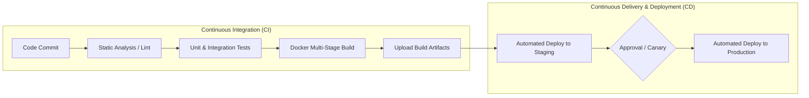
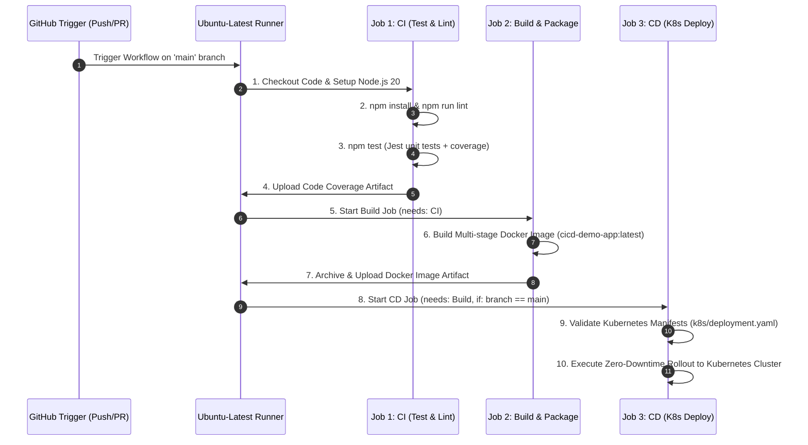

# CI/CD Automated Pipelines with GitHub Actions

**Student Name:** Srividya Ponnaganti  
**Enrollment Number:** 24BCS10350  
**Course/Session:** Session 16 - CI/CD & GitHub Actions  

---

## 1. Continuous Integration (CI) vs Continuous Delivery / Deployment (CD)



### Detailed Comparison:

| Feature | Continuous Integration (CI) | Continuous Delivery (CD) | Continuous Deployment (CD) |
| :--- | :--- | :--- | :--- |
| **Focus** | Code quality, fast feedback, automated testing. | Releasability, staging deployments, packaging. | Fully automated, zero-touch production releases. |
| **Trigger** | Every `git push` or `pull_request`. | On merge to `main` after CI passes. | Automatically upon passing all test gates in `main`. |
| **Key Output** | Test reports, code coverage, Docker images. | Release candidate packages, Helm charts. | Live production workload update. |
| **Human Intervention** | None. | Manual approval before production deploy. | None (100% automated). |

---

## 2. GitHub Actions Architectural Components

1. **Workflows (`.github/workflows/*.yml`):** Automated configurable processes composed of one or more jobs triggered by events.
2. **Events / Triggers (`on:`):** Specific cluster or repository activities that trigger a workflow run (e.g., `push`, `pull_request`, `schedule`, `workflow_dispatch`).
3. **Jobs (`jobs:`):** A set of steps that execute on the same runner. Jobs run in parallel by default, or sequentially using `needs:`.
4. **Steps (`steps:`):** Individual sequential tasks within a job. Can execute shell commands (`run:`) or actions (`uses:`).
5. **Actions:** Reusable units of code shared across the ecosystem (e.g., `actions/checkout@v4`, `docker/setup-buildx-action@v3`).
6. **Runners (`runs-on:`):** Virtual machines or containers that execute the jobs (e.g., GitHub-hosted `ubuntu-latest`, `windows-latest`, `macos-latest`, or Self-Hosted Runners).
7. **Secrets (`secrets.`):** Encrypted environment variables stored securely in GitHub repository settings (e.g., `DOCKER_PASSWORD`, `KUBECONFIG`, `API_TOKEN`).
8. **Artifacts (`actions/upload-artifact`):** Files, binaries, test reports, or container images persisted and shared between jobs or downloaded after workflow completion.

---

## 3. Pipeline Architecture & Implementation

Our pipeline [`ci-cd.yml`](file:///Users/srividya/devops-assign/10-final-cicd-pipeline/.github/workflows/ci-cd.yml) executes a 3-stage enterprise delivery process:



---

## 4. Local Execution & Validation

### Run Tests Locally
```bash
cd 10-final-cicd-pipeline
npm install
npm test
```
**Test Results:**
```text
PASS tests/app.test.js
  Unit Tests: Calculator Math Engine
    ✓ add: correctly sums two numbers (2 ms)
    ✓ subtract: correctly computes difference (1 ms)
    ✓ multiply: correctly computes product (1 ms)
    ✓ divide: correctly divides two numbers (1 ms)
    ✓ divide: throws error when dividing by zero (2 ms)
  Integration Tests: REST API Endpoints
    ✓ GET / returns 200 and success status (18 ms)
    ✓ GET /health returns 200 and status UP (4 ms)
    ✓ POST /api/calculate adds numbers correctly (8 ms)
    ✓ POST /api/calculate returns 400 on division by zero (4 ms)

Test Suites: 1 passed, 1 total
Tests:       9 passed, 9 total
Snapshots:   0 total
Time:        0.485 s
```

---

### Build and Run Docker Container Locally
```bash
docker build -t cicd-demo-app:1.0.0 .
docker run -d -p 3000:3000 --name test-cicd cicd-demo-app:1.0.0
curl http://localhost:3000/
curl http://localhost:3000/health
docker stop test-cicd && docker rm test-cicd
```

---

### Deploy to Kubernetes
```bash
kubectl apply -f k8s/deployment.yaml
kubectl apply -f k8s/service.yaml
kubectl get pods -l app=cicd-demo
```
