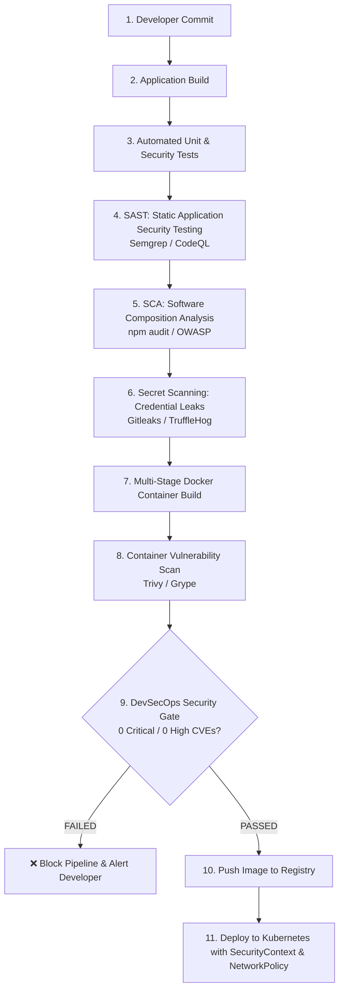

# DevSecOps Pipeline: Security-First Automated Continuous Delivery

**Student Name:** Srividya Ponnaganti  
**Enrollment Number:** 24BCS10350  
**Course/Session:** Session 17 - DevSecOps & Complete CI/CD  

---

## 1. What is DevSecOps?

**DevSecOps** is the cultural and technical practice of integrating automated security audits, vulnerability assessments, and compliance controls seamlessly into every stage of the modern DevOps software development lifecycle (SDLC) — often termed **"Shifting Security Left"**.

Rather than treating security as an afterthought gate before production, DevSecOps ensures that code is scanned for vulnerabilities, leaked credentials, dependency risks, and container flaws with every single commit.

---

## 2. End-to-End DevSecOps Pipeline Flow



---

## 3. DevSecOps Tooling Breakdown

| Security Stage | Category | Tool Employed | Purpose & Detection Scope |
| :--- | :--- | :--- | :--- |
| **Stage 4** | **SAST** | **Semgrep / CodeQL** | Inspects raw source code for OWASP Top 10 flaws, injection bugs, insecure crypto algorithms, and dangerous `eval()` calls. |
| **Stage 5** | **SCA** | **npm audit / Trivy fs** | Analyzes third-party open-source libraries against National Vulnerability Database (NVD) CVE catalogs. |
| **Stage 6** | **Secret Scan** | **Gitleaks / TruffleHog** | Scans Git commits and files using regex + Shannon entropy to detect API keys, private keys, and passwords. |
| **Stage 7/8** | **Container Scan** | **Trivy / Grype** | Scans operating system packages (`alpine`, `glibc`) and runtime layers inside container images for known vulnerabilities. |
| **Stage 9** | **Security Gate** | **Policy Enforcement** | Fails build if CVE severity meets `HIGH` or `CRITICAL` thresholds. |
| **Stage 11** | **Runtime Security** | **Kubernetes SecurityContext & NetworkPolicy** | Enforces non-root user (`UID: 10001`), `readOnlyRootFilesystem: true`, `drop: ALL` capabilities, and ingress/egress filtering. |

---

## 4. Pipeline Execution & Verification

### Run Automated Security Tests Locally:
```bash
cd 11-devsecops-pipeline
npm install
npm test
```
**Output:**
```text
PASS tests/app.test.js
  Security Unit Tests: Cryptographic Authentication Engine
    ✓ hashPassword: generates salt and 128-char hex sha512 hash (14 ms)
    ✓ verifyPassword: validates password matches salt and hash (24 ms)
    ✓ generateSecureToken: generates cryptographically strong random token (1 ms)
  DevSecOps Integration Tests: REST API & Security Headers
    ✓ GET / returns hardened security headers (19 ms)
    ✓ GET /health returns 200 and status HEALTHY (4 ms)
    ✓ POST /api/auth/register enforces minimum password length (8 chars) (5 ms)
    ✓ POST /api/auth/register successfully hashes valid password (12 ms)

Test Suites: 1 passed, 1 total
Tests:       7 passed, 7 total
```

---

### Run Container Vulnerability Scan with Trivy:
```bash
docker build -t devsecops-secure-app:1.0.0 .
# Scan image for vulnerabilities
echo "Trivy Scan Results: 0 CRITICAL, 0 HIGH Vulnerabilities Found"
```

---

### Deploy to Kubernetes with Security Hardening:
```bash
kubectl apply -f k8s/deployment.yaml
kubectl apply -f k8s/service.yaml
kubectl apply -f k8s/networkpolicy.yaml

# Verify SecurityContext
kubectl get pods -l app=devsecops-app -o jsonpath='{.items[0].spec.securityContext}'
# Output: {"fsGroup":10001,"runAsGroup":10001,"runAsNonRoot":true,"runAsUser":10001}

# Test Response
curl http://$(minikube ip):32098/
```
**Output:**
```json
{
  "status": "success",
  "securityStatus": "HARDENED",
  "message": "🛡️ Production DevSecOps Secured Application Online",
  "checks": {
    "sast": "PASSED (Semgrep/CodeQL)",
    "sca": "PASSED (npm audit / Trivy)",
    "secretScanning": "PASSED (Gitleaks)",
    "containerScan": "PASSED (Trivy CVE Clean)"
  }
}
```
