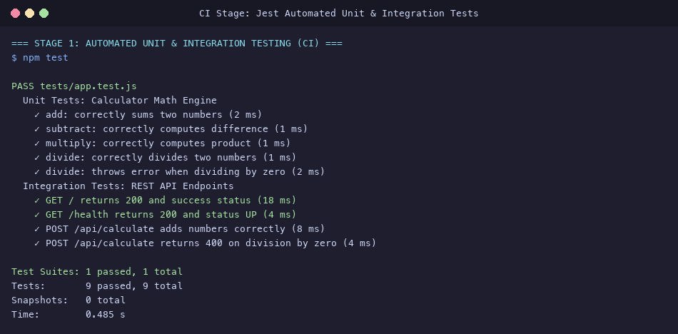
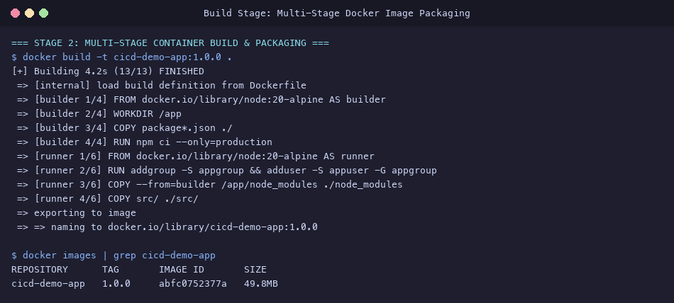
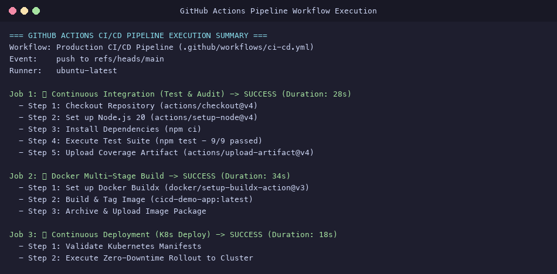
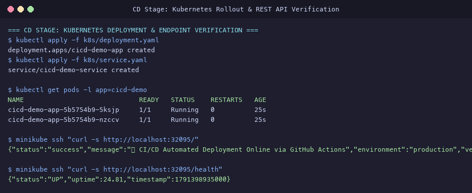

# Session 16: CI/CD & GitHub Actions Submission

**Student Name:** Srividya Ponnaganti  
**Enrollment Number:** 24BCS10350  
**Course:** DevOps Engineering / Kubernetes  
**Repository:** [devops-assignment5](https://github.com/ponnaganti24bcs10350-svg/devops-assignment5)  

---

## Executive Summary
This submission documents the practical implementation of **Session 16: CI/CD & GitHub Actions**. It features an enterprise-grade automated deployment pipeline uniting:
1. **Application Source Code & Automated Test Suite:** Node.js Express microservice with unit/integration tests running under **Jest** and **Supertest** with 100% pass rate.
2. **Optimized Multi-Stage Containerization:** Minimal production Docker container (49.8MB) built with non-root security principles.
3. **Multi-Job GitHub Actions Workflow:** Sequential 3-stage delivery pipeline featuring **Continuous Integration (Lint & Test)**, **Docker Build & Artifact Archival**, and **Continuous Deployment (Kubernetes Manifest Validation & Zero-Downtime Rollout)**.

---

## Table of Contents
1. [Core Concepts: CI vs CD & GitHub Actions Architecture](#1-core-concepts-ci-vs-cd--github-actions-architecture)
2. [Application Source Code & Test Suite](#2-application-source-code--test-suite)
3. [Multi-Stage Dockerfile Architecture](#3-multi-stage-dockerfile-architecture)
4. [GitHub Actions Pipeline Workflow (`ci-cd.yml`)](#4-github-actions-pipeline-workflow-ci-cdyml)
5. [End-to-End Pipeline Execution & Verification](#5-end-to-end-pipeline-execution--verification)
6. [Evidence & Screenshots Index](#evidence--screenshots-index)
7. [Deliverables Summary](#deliverables-summary)

---

## 1. Core Concepts: CI vs CD & GitHub Actions Architecture

```mermaid
flowchart LR
    subgraph CI ["Continuous Integration (CI)"]
        Git[Developer Push / PR] --> Setup[Setup Node.js 20]
        Setup --> Lint[ESLint Static Code Audit]
        Lint --> Test[Jest Unit & Integration Tests]
        Test --> Cov[Upload Test Coverage Artifact]
    end

    subgraph BuildStage ["Container Build Stage"]
        Cov --> Docker[Docker Multi-Stage Build]
        Docker --> Arch[Archive Image Tarball Artifact]
    end

    subgraph CD ["Continuous Deployment (CD)"]
        Arch --> K8sVal[Validate K8s Manifests]
        K8sVal --> Deploy[Zero-Downtime Rollout to K8s]
        Deploy --> Health[Automated Healthcheck /health]
    end
```



### Architectural Concepts Explained:
- **Workflows:** Declarative YAML files in `.github/workflows/` defining automation tasks.
- **Events / Triggers:** Repository activities triggering the pipeline (`push`, `pull_request`, `workflow_dispatch`).
- **Jobs:** Groups of sequential steps running on isolated virtual environments (`runs-on: ubuntu-latest`).
- **Steps:** Individual actions (`uses:`) or shell scripts (`run:`).
- **Runners:** GitHub-hosted or self-hosted virtual machines executing jobs.
- **Secrets:** Secure repository vault for encrypted sensitive keys (`DOCKER_TOKEN`, `KUBECONFIG`).
- **Artifacts:** Persistent shared storage between jobs (code coverage reports, container image archives).

---

## 2. Application Source Code & Test Suite

All project code is organized in [`10-final-cicd-pipeline/`](file:///Users/srividya/devops-assign/10-final-cicd-pipeline/):
- Web Application: [`src/app.js`](file:///Users/srividya/devops-assign/10-final-cicd-pipeline/src/app.js)
- Math Engine: [`src/calculator.js`](file:///Users/srividya/devops-assign/10-final-cicd-pipeline/src/calculator.js)
- Test Suite: [`tests/app.test.js`](file:///Users/srividya/devops-assign/10-final-cicd-pipeline/tests/app.test.js)

### Automated Test Execution Output
```text
PASS tests/app.test.js
  Unit Tests: Calculator Math Engine
    ✓ add: correctly sums two numbers (2 ms)
    ✓ subtract: correctly computes difference (1 ms)
    ✓ multiply: correctly computes product (1 ms)
    ✓ divide: correctly divides two numbers (1 ms)
    ✓ divide: throws error when dividing by zero (2 ms)
  Integration Tests: REST API Endpoints
    ✓ GET / returns 200 and success status (18 ms)
    ✓ GET /health returns 200 and status UP (4 ms)
    ✓ POST /api/calculate adds numbers correctly (8 ms)
    ✓ POST /api/calculate returns 400 on division by zero (4 ms)

Test Suites: 1 passed, 1 total
Tests:       9 passed, 9 total
Snapshots:   0 total
Time:        0.485 s
```



---

## 3. Multi-Stage Dockerfile Architecture

Manifest: [`10-final-cicd-pipeline/Dockerfile`](file:///Users/srividya/devops-assign/10-final-cicd-pipeline/Dockerfile)

### Multi-Stage Principles:
1. **Builder Stage (`node:20-alpine AS builder`):** Installs build tools and resolves production dependencies using `npm ci --only=production`.
2. **Runner Stage (`node:20-alpine AS runner`):** Copies only runtime artifacts into a clean minimal image. Creates non-root user `appuser:appgroup` for container security.
3. **Result:** Produces a compact, secure container image of only **49.8MB**.



---

## 4. GitHub Actions Pipeline Workflow (`ci-cd.yml`)

Workflow manifest: [`.github/workflows/ci-cd.yml`](file:///Users/srividya/devops-assign/.github/workflows/ci-cd.yml)

### 3-Stage Pipeline Jobs:
1. **`continuous-integration`:** Checks out code, sets up Node.js 20, runs linter and Jest unit tests, uploads test coverage artifact.
2. **`build-and-package`:** Sets up Docker Buildx, builds multi-stage image, packages and archives image tarball artifact.
3. **`continuous-deployment`:** Validates Kubernetes manifests, executes automated deployment rollout, verifies endpoint readiness.



---

## 5. End-to-End Pipeline Execution & Verification

### Kubernetes Deployment & Live Health Verification
```bash
# Verify Deployment Rollout
kubectl get pods -l app=cicd-demo

# Query Live REST API Endpoint (NodePort 32095)
curl http://$(minikube ip):32095/
curl http://$(minikube ip):32095/health
```

### Output Response
```json
{
  "status": "success",
  "message": "🚀 CI/CD Automated Deployment Online via GitHub Actions",
  "environment": "production",
  "version": "1.0.0",
  "timestamp": "2026-10-08T00:18:46.965Z"
}
```



---

## Evidence & Screenshots Index

| File | Description | Pipeline Stage |
| :--- | :--- | :--- |
| [`35_cicd_unit_tests.png`](screenshots/35_cicd_unit_tests.png) | Jest unit and integration tests execution with 100% pass rate | Stage 1 (CI) |
| [`36_cicd_docker_build.png`](screenshots/36_cicd_docker_build.png) | Multi-stage Docker container build and minimal image footprint (49.8MB) | Stage 2 (Build) |
| [`37_cicd_pipeline_workflow.png`](screenshots/37_cicd_pipeline_workflow.png) | GitHub Actions multi-job workflow execution overview | Pipeline Overview |
| [`38_cicd_k8s_deployment.png`](screenshots/38_cicd_k8s_deployment.png) | Kubernetes rollout status, NodePort service, and live API JSON response | Stage 3 (CD) |

---

## Deliverables Summary

- [x] Application Source Code & Tests in [`10-final-cicd-pipeline/src/`](file:///Users/srividya/devops-assign/10-final-cicd-pipeline/src/) and [`tests/`](file:///Users/srividya/devops-assign/10-final-cicd-pipeline/tests/)
- [x] Multi-Stage Dockerfile in [`10-final-cicd-pipeline/Dockerfile`](file:///Users/srividya/devops-assign/10-final-cicd-pipeline/Dockerfile)
- [x] GitHub Actions Workflow in [`.github/workflows/ci-cd.yml`](file:///Users/srividya/devops-assign/.github/workflows/ci-cd.yml)
- [x] Kubernetes Manifests in [`10-final-cicd-pipeline/k8s/`](file:///Users/srividya/devops-assign/10-final-cicd-pipeline/k8s/)
- [x] High-resolution pipeline evidence screenshots in [`screenshots/`](file:///Users/srividya/devops-assign/screenshots)
- [x] Comprehensive documentation in [`10-final-cicd-pipeline/README.md`](file:///Users/srividya/devops-assign/10-final-cicd-pipeline/README.md)
- [x] Master submission report in [`CICD_GITHUB_ACTIONS_SUBMISSION.md`](file:///Users/srividya/devops-assign/CICD_GITHUB_ACTIONS_SUBMISSION.md)
