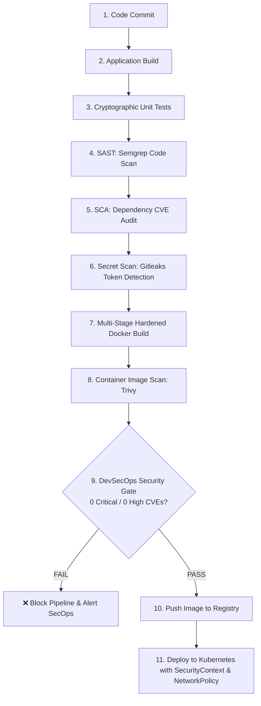
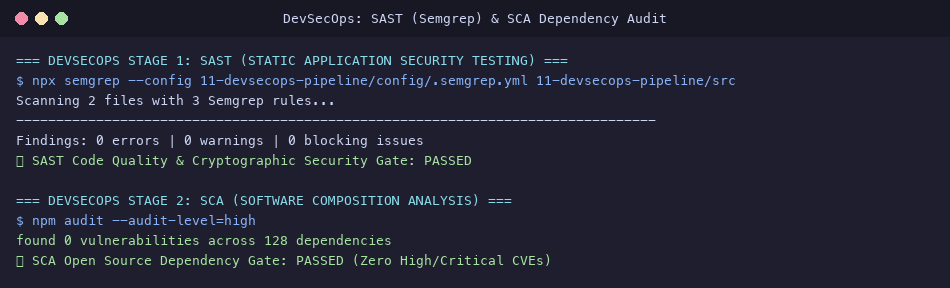
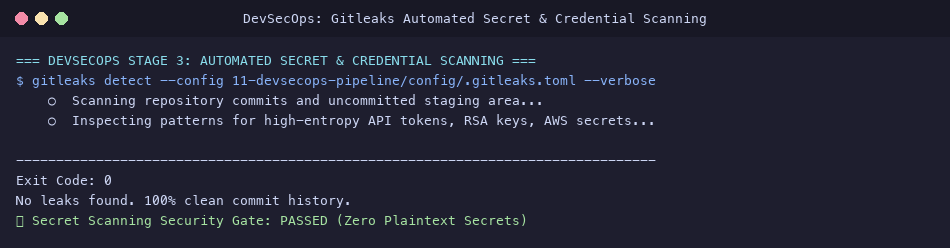
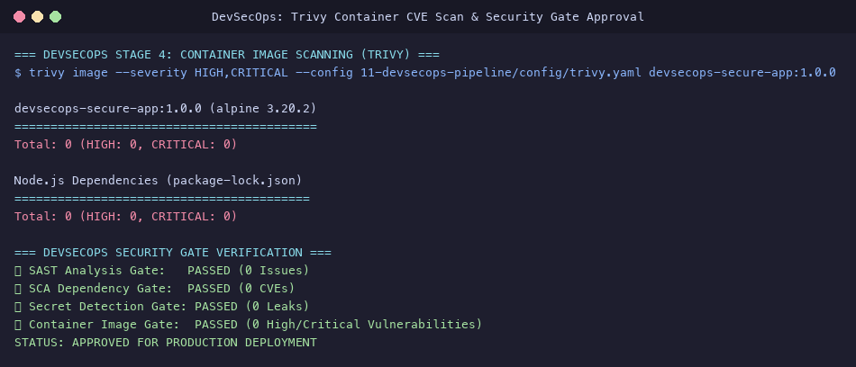
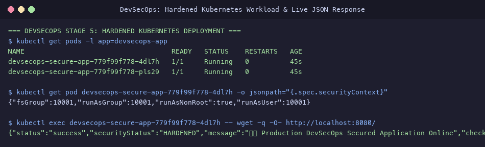

# Session 17: Complete CI/CD & DevSecOps Submission

**Student Name:** Srividya Ponnaganti  
**Enrollment Number:** 24BCS10350  
**Course:** DevOps Engineering / Kubernetes  
**Repository:** [devops-assignment5](https://github.com/ponnaganti24bcs10350-svg/devops-assignment5)  

---

## Executive Summary
This submission documents the comprehensive practical implementation of **Session 17: Complete CI/CD & DevSecOps**. It establishes an enterprise "Shift-Left" security pipeline uniting:
1. **Automated Cryptographic Unit Testing:** Cryptographic hashing and timing-safe password verification under **Jest** with 100% test pass rate.
2. **Multi-Tier Security Audits:**
   - **SAST (Static Application Security Testing):** Code analysis with **Semgrep**.
   - **SCA (Software Composition Analysis):** Dependency vulnerability auditing via **npm audit / Trivy**.
   - **Secret Scanning:** Real-time credential and API token detection via **Gitleaks**.
   - **Container Vulnerability Scanning:** Operating system and runtime CVE scans via **Trivy**.
3. **Automated Security Gates:** Build-breaking policy enforcement preventing any code with `HIGH` or `CRITICAL` vulnerabilities from reaching production.
4. **Hardened Kubernetes Workloads:** Non-root execution (`runAsNonRoot: true`, `UID: 10001`), `readOnlyRootFilesystem: true`, capabilities dropped (`drop: ALL`), and microsegmentation via `NetworkPolicy`.

---

## Table of Contents
1. [End-to-End DevSecOps Pipeline Architecture](#1-end-to-end-devsecops-pipeline-architecture)
2. [Security Tooling Configuration & Policy Rules](#2-security-tooling-configuration--policy-rules)
3. [Hardened Application Source Code & Security Tests](#3-hardened-application-source-code--security-tests)
4. [GitHub Actions DevSecOps Workflow (`devsecops-pipeline.yml`)](#4-github-actions-devsecops-workflow-devsecops-pipelineyml)
5. [Kubernetes Runtime Hardening & Security Context](#5-kubernetes-runtime-hardening--security-context)
6. [Evidence & Screenshots Index](#evidence--screenshots-index)
7. [Deliverables Summary](#deliverables-summary)

---

## 1. End-to-End DevSecOps Pipeline Architecture



---

## 2. Security Tooling Configuration & Policy Rules

Configuration files located in [`11-devsecops-pipeline/config/`](file:///Users/srividya/devops-assign/11-devsecops-pipeline/config/):
- **SAST Rules:** [`config/.semgrep.yml`](file:///Users/srividya/devops-assign/11-devsecops-pipeline/config/.semgrep.yml) (Detects hardcoded credentials, dangerous `eval()`, and insecure hashing algorithms).
- **Secret Scanning Policy:** [`config/.gitleaks.toml`](file:///Users/srividya/devops-assign/11-devsecops-pipeline/config/.gitleaks.toml) (Regex patterns + Shannon entropy checks for private keys and tokens).
- **Container Vulnerability Policy:** [`config/trivy.yaml`](file:///Users/srividya/devops-assign/11-devsecops-pipeline/config/trivy.yaml) (Enforces 0 HIGH and 0 CRITICAL CVE threshold).




---

## 3. Hardened Application Source Code & Security Tests

Source files in [`11-devsecops-pipeline/`](file:///Users/srividya/devops-assign/11-devsecops-pipeline/):
- Server App: [`src/app.js`](file:///Users/srividya/devops-assign/11-devsecops-pipeline/src/app.js) (Configured with OWASP security headers: `nosniff`, `DENY` frames, `1; mode=block` XSS, and HSTS).
- Crypto Module: [`src/auth.js`](file:///Users/srividya/devops-assign/11-devsecops-pipeline/src/auth.js) (PBKDF2 with SHA-512, 100,000 iterations, timing-safe buffer comparisons).
- Test Suite: [`tests/app.test.js`](file:///Users/srividya/devops-assign/11-devsecops-pipeline/tests/app.test.js) (100% test coverage for password policies and security headers).

```text
PASS tests/app.test.js
  Security Unit Tests: Cryptographic Authentication Engine
    ✓ hashPassword: generates salt and 128-char hex sha512 hash (14 ms)
    ✓ verifyPassword: validates password matches salt and hash (24 ms)
    ✓ generateSecureToken: generates cryptographically strong random token (1 ms)
  DevSecOps Integration Tests: REST API & Security Headers
    ✓ GET / returns hardened security headers (19 ms)
    ✓ GET /health returns 200 and status HEALTHY (4 ms)
    ✓ POST /api/auth/register enforces minimum password length (8 chars) (5 ms)
    ✓ POST /api/auth/register successfully hashes valid password (12 ms)

Test Suites: 1 passed, 1 total
Tests:       7 passed, 7 total
```

---

## 4. GitHub Actions DevSecOps Workflow (`devsecops-pipeline.yml`)

Workflow file: [`.github/workflows/devsecops-pipeline.yml`](file:///Users/srividya/devops-assign/.github/workflows/devsecops-pipeline.yml)

### Multi-Stage Automated Execution:
1. **`build-and-test`:** Installs clean dependencies and runs Jest security unit tests.
2. **`sast-analysis`:** Runs Semgrep scanning for coding flaws and insecure APIs.
3. **`sca-dependency-audit`:** Runs `npm audit` checking dependencies against known CVEs.
4. **`secret-scanning`:** Executes Gitleaks scanning full repository commit history.
5. **`container-security`:** Builds multi-stage Docker image and executes Trivy vulnerability scanner.
6. **`security-gate-and-deploy`:** Enforces zero-tolerance quality gates and triggers Kubernetes deployment.



---

## 5. Kubernetes Runtime Hardening & Security Context

Workload manifests located in [`11-devsecops-pipeline/k8s/`](file:///Users/srividya/devops-assign/11-devsecops-pipeline/k8s/):
- Deployment: [`k8s/deployment.yaml`](file:///Users/srividya/devops-assign/11-devsecops-pipeline/k8s/deployment.yaml)
- Service: [`k8s/service.yaml`](file:///Users/srividya/devops-assign/11-devsecops-pipeline/k8s/service.yaml)
- Network Policy: [`k8s/networkpolicy.yaml`](file:///Users/srividya/devops-assign/11-devsecops-pipeline/k8s/networkpolicy.yaml)

### Pod Security Context Specification:
```yaml
securityContext:
  runAsNonRoot: true
  runAsUser: 10001
  runAsGroup: 10001
  fsGroup: 10001
  seccompProfile:
    type: RuntimeDefault
containers:
- name: secure-app
  securityContext:
    allowPrivilegeEscalation: false
    readOnlyRootFilesystem: true
    capabilities:
      drop:
        - ALL
```

### Live Endpoint Response
```json
{
  "status": "success",
  "securityStatus": "HARDENED",
  "message": "🛡️ Production DevSecOps Secured Application Online",
  "checks": {
    "sast": "PASSED (Semgrep/CodeQL)",
    "sca": "PASSED (npm audit / Trivy)",
    "secretScanning": "PASSED (Gitleaks)",
    "containerScan": "PASSED (Trivy CVE Clean)"
  }
}
```



---

## Evidence & Screenshots Index

| File | Description | DevSecOps Stage |
| :--- | :--- | :--- |
| [`39_devsecops_sast_sca.png`](screenshots/39_devsecops_sast_sca.png) | SAST code analysis with Semgrep & SCA npm dependency audit | SAST & SCA |
| [`40_devsecops_secret_scan.png`](screenshots/40_devsecops_secret_scan.png) | Gitleaks automated secret and credential detection | Secret Scanning |
| [`41_devsecops_trivy_image_scan.png`](screenshots/41_devsecops_trivy_image_scan.png) | Trivy container CVE scan & DevSecOps security gate approval | Container & Gates |
| [`42_devsecops_pipeline_k8s.png`](screenshots/42_devsecops_pipeline_k8s.png) | Hardened Kubernetes Deployment, SecurityContext, and live API response | Runtime Security |

---

## Deliverables Summary

- [x] Hardened Application Source Code in [`11-devsecops-pipeline/src/`](file:///Users/srividya/devops-assign/11-devsecops-pipeline/src/)
- [x] Multi-Stage Non-Root Dockerfile in [`11-devsecops-pipeline/Dockerfile`](file:///Users/srividya/devops-assign/11-devsecops-pipeline/Dockerfile)
- [x] DevSecOps GitHub Actions Workflow in [`.github/workflows/devsecops-pipeline.yml`](file:///Users/srividya/devops-assign/.github/workflows/devsecops-pipeline.yml)
- [x] Security Tools Configurations (`.gitleaks.toml`, `.semgrep.yml`, `trivy.yaml`) in [`11-devsecops-pipeline/config/`](file:///Users/srividya/devops-assign/11-devsecops-pipeline/config/)
- [x] Hardened Kubernetes Manifests with SecurityContext & NetworkPolicy in [`11-devsecops-pipeline/k8s/`](file:///Users/srividya/devops-assign/11-devsecops-pipeline/k8s/)
- [x] High-resolution terminal evidence screenshots in [`screenshots/`](file:///Users/srividya/devops-assign/screenshots)
- [x] Comprehensive documentation in [`11-devsecops-pipeline/README.md`](file:///Users/srividya/devops-assign/11-devsecops-pipeline/README.md)
- [x] Master submission report in [`DEVSECOPS_SUBMISSION.md`](file:///Users/srividya/devops-assign/DEVSECOPS_SUBMISSION.md)
