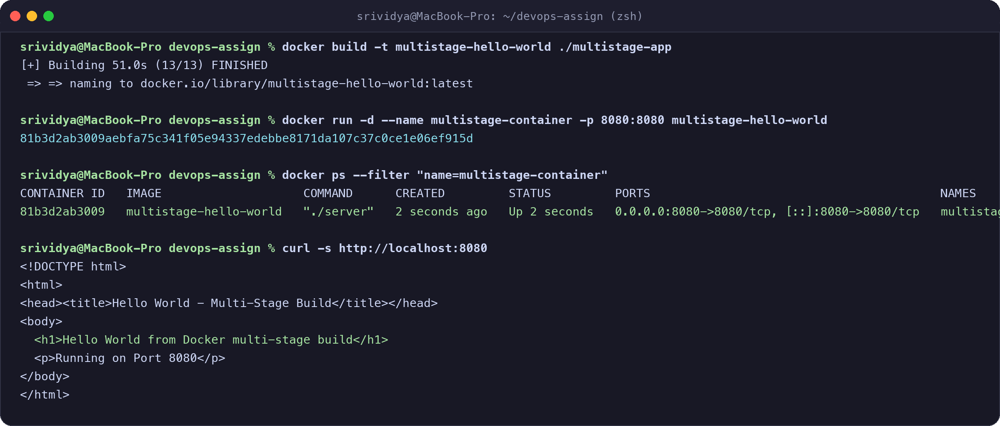

# Docker Multi-Stage Build Homework

**Name:** Srividya Ponnaganti  
**Enrollment Number:** 24BCS10350  
**GitHub Repository:** https://github.com/ponnaganti24bcs10350-svg/devops-assignment5  

---

## Task 1 & Task 2: Multi-Stage Build & Verification

### 1. Multi-Stage Dockerfile (`multistage-app/Dockerfile`)
The multi-stage build compiles the application in a temporary builder stage and copies only the minimal compiled binary into a lightweight production image:

```dockerfile
# Stage 1: Build Stage
FROM golang:1.21-alpine AS builder
WORKDIR /app
COPY main.go ./
RUN go build -o server main.go

# Stage 2: Production Final Stage
FROM alpine:latest
WORKDIR /app
COPY --from=builder /app/server ./
EXPOSE 8080
CMD ["./server"]
```

---

### 2. Terminal Commands and Verification

```bash
# Build the multi-stage Docker image
docker build -t multistage-hello-world ./multistage-app

# Run container on port 8080
docker run -d --name multistage-container -p 8080:8080 multistage-hello-world

# Verify container is running on port 8080
docker ps --filter "name=multistage-container"

# Access application and verify output
curl -s http://localhost:8080
```

---

### 3. Screenshot of Running Application & `docker ps` on Port 8080



#### Output Verification:
- **`docker ps` Status:** Container `multistage-container` running on `0.0.0.0:8080->8080/tcp`.
- **Response Received:**
  ```html
  <h1>Hello World from Docker multi-stage build</h1>
  <p>Running on Port 8080</p>
  ```

---

## Task 3: Docker Application Deployment (3 Different Types)

I deployed 3 different types of web applications using Docker:

### 1. Node.js Application (`nodejs-app`)
- **Folder:** `nodejs-app/`
- **Port:** 3000
- **Build & Run:**
  ```bash
  docker build -t nodejs-hello-world ./nodejs-app
  docker run -d -p 3000:3000 --name nodejs-app nodejs-hello-world
  ```
- **Verification:** Serves Hello World on `http://localhost:3000`.

---

### 2. Python Application (`python-app`)
- **Folder:** `python-app/`
- **Port:** 5000
- **Build & Run:**
  ```bash
  docker build -t python-hello-world ./python-app
  docker run -d -p 5000:5000 --name python-app python-hello-world
  ```
- **Verification:** Serves Hello World on `http://localhost:5000`.

---

### 3. Java Application (`java-app`)
- **Folder:** `java-app/`
- **Port:** 8080
- **Build & Run:**
  ```bash
  docker build -t java-hello-world ./java-app
  docker run -d -p 8080:8080 --name java-app java-hello-world
  ```
- **Verification:** Serves Hello World on `http://localhost:8080`.
