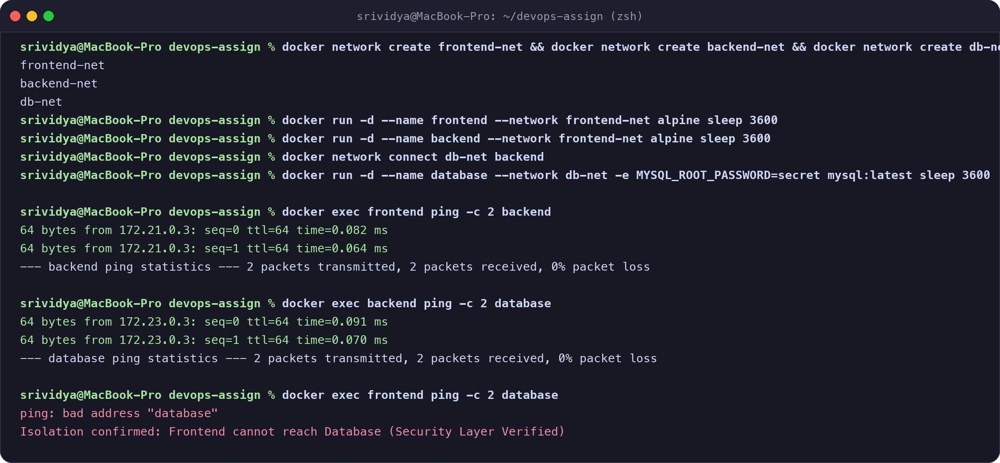
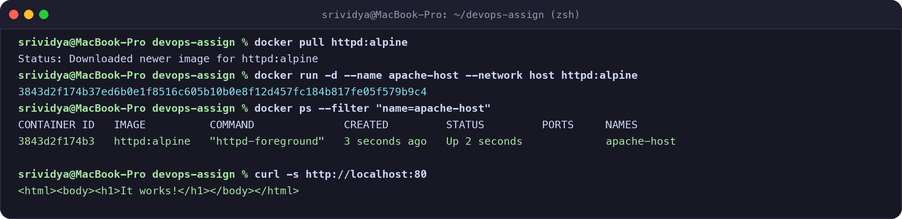
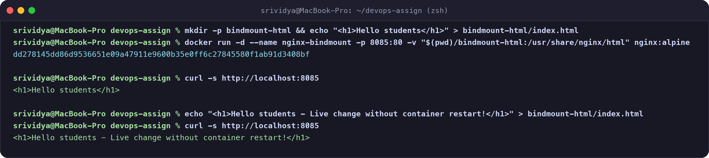

# Docker Networking & Volume Homework Tasks

**Name:** Srividya Ponnaganti  
**Enrollment Number:** 24BCS10350  
**GitHub Repository:** https://github.com/ponnaganti24bcs10350-svg/devops-assignment5  

---

## Task 1: Docker Container Networking (Multi-Tier Isolation)

### 1. Setup
I created 3 separate Docker bridge networks:
- `frontend-net`
- `backend-net`
- `db-net`

Then I launched 3 containers:
- `frontend` (connected to `frontend-net`)
- `backend` (connected to both `frontend-net` and `db-net`)
- `database` (connected to `db-net`)

```bash
# Create networks
docker network create frontend-net
docker network create backend-net
docker network create db-net

# Create containers
docker run -d --name frontend --network frontend-net alpine sleep 3600
docker run -d --name backend --network frontend-net alpine sleep 3600
docker network connect db-net backend
docker run -d --name database --network db-net -e MYSQL_ROOT_PASSWORD=secret mysql:latest sleep 3600
```

### 2. Connectivity Test & Verification
- **Frontend &rarr; Backend:** Succeeded (both share `frontend-net`).
- **Backend &rarr; Database:** Succeeded (both share `db-net`).
- **Frontend &rarr; Database:** Blocked / Failed (network isolation prevents direct frontend access to the database).



---

## Task 2: Host Network

I pulled the Apache HTTP Server image and ran the container using the host network driver (`--network host`):

```bash
# Pull image
docker pull httpd:alpine

# Run container attached directly to host network
docker run -d --name apache-host --network host httpd:alpine

# Verify container and access on port 80
docker ps --filter "name=apache-host"
curl -s http://localhost:80
```



- **Observation:** When using `--network host`, the container shares the host's networking namespace directly without Docker NAT or port mapping. The website is accessible directly on port 80.

---

## Task 3: Bind Mount

I created a local folder with an `index.html` file and mounted it into an Nginx container:

```bash
# Create local folder and file
mkdir -p bindmount-html
echo "<h1>Hello students</h1>" > bindmount-html/index.html

# Run Nginx with bind mount
docker run -d --name nginx-bindmount -p 8085:80 -v "$(pwd)/bindmount-html:/usr/share/nginx/html" nginx:alpine

# Test initial access
curl -s http://localhost:8085

# Update file locally
echo "<h1>Hello students - Live change without container restart!</h1>" > bindmount-html/index.html

# Test access again without restarting container
curl -s http://localhost:8085
```



- **Observation:** Changes made to the host file (`index.html`) were instantly reflected when querying the web server without needing to rebuild the image or restart the container.

---

## Task 4: Research on Docker Overlay Network

### 1. What is an Overlay Network?
A Docker **Overlay Network** is a multi-host network driver that connects multiple Docker daemons (hosts) together. It allows containers running on different physical or virtual machines to communicate securely with each other as if they were on the same local network.

### 2. Primary Use Cases
- **Docker Swarm & Multi-Host Clusters:** Allowing distributed microservices running across different worker nodes to communicate directly.
- **Service Discovery & Load Balancing:** Built-in DNS and routing mesh allow containers to discover services by service name across hosts.
- **Secure Cross-Host Communication:** Automatic TLS encryption can be enabled on the overlay network to secure traffic passing between hosts across untrusted public/private networks.

### 3. How Overlay Networks Work (Technical Architecture)
1. **VXLAN Encapsulation:** Overlay networks use **VXLAN (Virtual Extensible LAN)** tunneling technology (UDP port 4789).
2. **Packet Flow:**
   - Container A on Host 1 sends an Ethernet frame destined for Container B on Host 2.
   - The Docker host intercepts this Layer 2 frame and wraps (encapsulates) it inside a standard Layer 4 UDP packet.
   - The packet is transmitted across the underlying physical network (underlay) to Host 2.
   - Host 2 receives the UDP packet, decapsulates the original Layer 2 frame, and delivers it to Container B.
3. **Control Plane:** Docker uses an internal distributed Key-Value store and gossip protocol to synchronize container IP addresses and MAC addresses across all nodes in the cluster.
