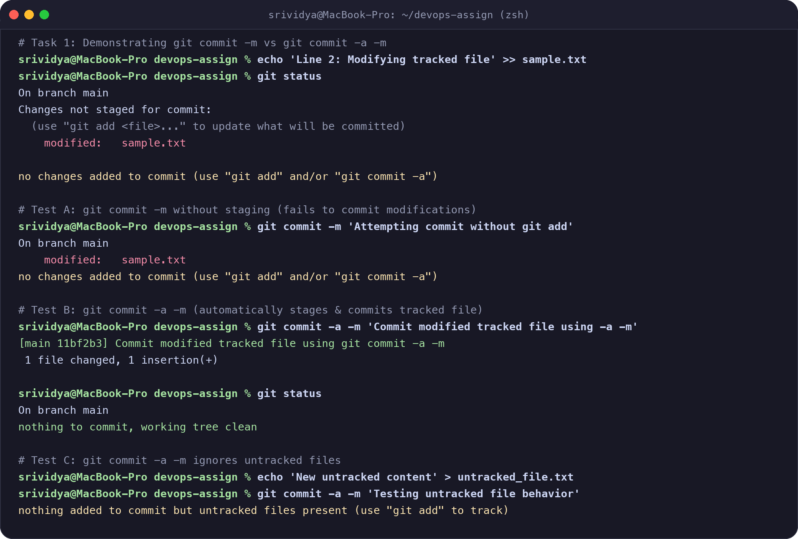
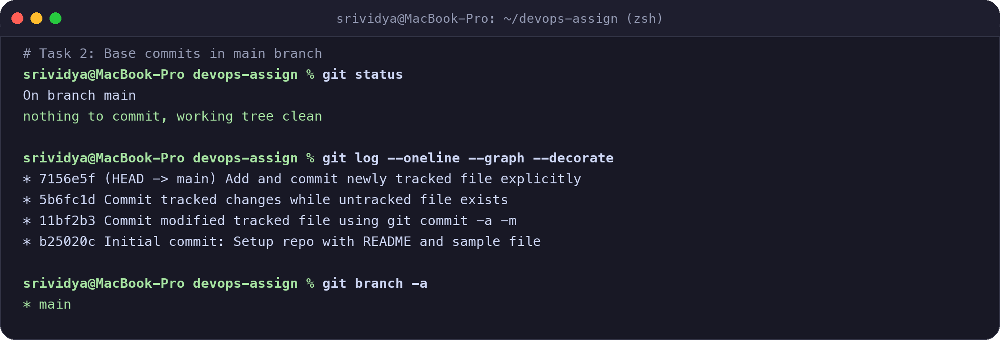
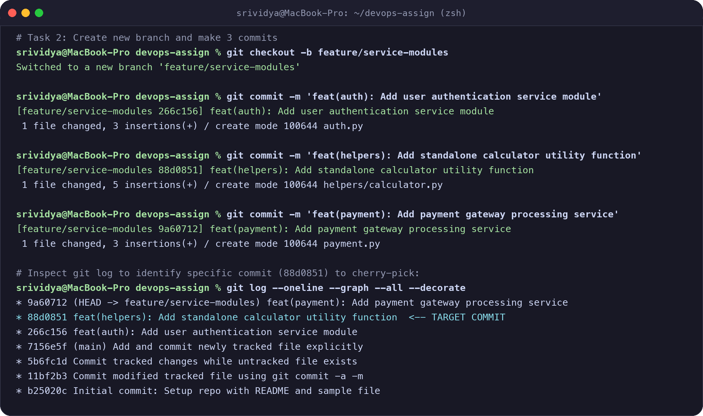
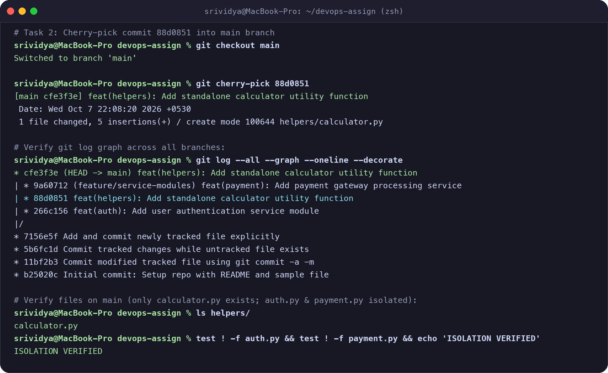

# Git Homework Tasks Submission Report

**Student Name:** Srividya Ponnaganti  
**Course / Assignment:** DevOps - Git Homework Tasks  
**Date:** October 7, 2026  
**Repository Branch Structure:** `main`, `feature/service-modules`  
**GitHub Repository:** [https://github.com/ponnaganti24bcs10350-svg/devops-assignment5](https://github.com/ponnaganti24bcs10350-svg/devops-assignment5)

---

## Table of Contents
1. [Task 1: `git commit -a -m` vs `git commit -m`](#task-1-git-commit--a--m-vs-git-commit--m)
   - [Core Concept & Differences](#11-core-concept--differences)
   - [Practical Demonstration & Terminal Screenshots](#12-practical-demonstration--terminal-screenshots)
   - [Key Takeaways](#13-key-takeaways)
2. [Task 2: Git Cherry-Pick](#task-2-git-cherry-pick)
   - [Concept & Use Cases](#21-concept--use-cases)
   - [Step 1: Commits in `main` Branch](#step-1-commits-in-main-branch)
   - [Step 2: Create New Branch & Make Commits](#step-2-create-new-branch--make-commits)
   - [Step 3: Identify Specific Commit using `git log`](#step-3-identify-specific-commit-using-git-log)
   - [Step 4: Cherry-Pick Target Commit to `main`](#step-4-cherry-pick-target-commit-to-main)
   - [Step 5: Verification & Inspection](#step-5-verification--inspection)
3. [Summary of Git Commands Used](#summary-of-git-commands-used)

---

## Task 1: `git commit -a -m` vs `git commit -m`

### 1.1 Core Concept & Differences

In Git, preparing changes to be saved into history involves two areas: the **Working Directory** and the **Staging Area (Index)**.

| Feature / Behavior | `git commit -m "message"` | `git commit -a -m "message"` |
| :--- | :--- | :--- |
| **Requires prior `git add`?** | **Yes**, only commits changes that are already staged in the Index. | **No** (for tracked files). Automatically stages and commits. |
| **Handles modified tracked files?** | Only if explicitly staged with `git add <file>`. | **Yes**, automatically stages and commits all modified tracked files. |
| **Handles deleted tracked files?** | Only if explicitly staged with `git add`/`git rm`. | **Yes**, automatically stages removals of tracked files. |
| **Handles brand new (untracked) files?** | **No**. Must run `git add <new_file>` first. | **No**. `-a` only affects already *tracked* files. Untracked files remain untouched. |
| **Primary Use Case** | Granular, intentional commits where only specific files or hunks should be committed. | Quick commits when all edits across existing project files should be saved together. |

---

### 1.2 Practical Demonstration & Terminal Screenshots

#### Terminal Output Screenshot:


#### Explanation of Tests Performed:

- **Test A: Modifying a tracked file and running `git commit -m` without staging**  
  Modifications were made to `sample.txt`. Running `git commit -m` resulted in `no changes added to commit` because the modifications were not staged in the Git Index.
  
- **Test B: Using `git commit -a -m` on modified tracked files**  
  Running `git commit -a -m` automatically staged and committed `sample.txt` in a single operation. The working tree was rendered clean.
  
- **Test C: Behavior with untracked files**  
  A new untracked file `untracked_file.txt` was created. Running `git commit -a -m` ignored the untracked file, proving that `-a` only stages modifications on already tracked files.

---

### 1.3 Key Takeaways
- `git commit -m` strictly respects the staging area.
- `git commit -a -m` is shorthand for `git add -u` (stage modified and deleted tracked files) followed by `git commit -m`.
- New files must always be tracked with `git add` at least once before `-a` can include them.

---

## Task 2: Git Cherry-Pick

### 2.1 Concept & Use Cases

`git cherry-pick <commit-hash>` allows you to choose a specific commit from one branch and apply its exact changes onto your current working branch as a brand new commit.

#### Common Real-World Scenarios:
1. **Hotfixing Production:** Porting an urgent bug fix commit from a development/feature branch directly into `main`/`production` without releasing unfinished features.
2. **Extracting Shared Utilities:** Pulling a standalone helper function or module from an experimental branch into the main codebase.
3. **Selective Merging:** When a full branch merge or rebase would bring unwanted commits.

---

### Step 1: Commits in `main` Branch

We established the baseline repository history on `main`:



```bash
$ git log --oneline --graph --decorate
* 7156e5f (HEAD -> main) Add and commit newly tracked file explicitly
* 5b6fc1d Commit tracked changes while untracked file exists
* 11bf2b3 Commit modified tracked file using git commit -a -m
* b25020c Initial commit: Setup repo with README and sample file
```

---

### Step 2 & 3: Create New Branch, Make Commits, and Identify Target Commit

We created a feature branch named `feature/service-modules` and added 3 discrete commits:



1. `266c156` - `feat(auth): Add user authentication service module` (`auth.py`)
2. `88d0851` - `feat(helpers): Add standalone calculator utility function` (`helpers/calculator.py`) **<-- Target Commit**
3. `9a60712` - `feat(payment): Add payment gateway processing service` (`payment.py`)

Using `git log --oneline --graph --all --decorate`, we identified the commit hash: **`88d0851`**.

---

### Step 4 & 5: Cherry-Pick Target Commit to `main` & Verification

We switched back to `main`, cherry-picked commit `88d0851`, and verified the commit tree and isolated files:



```bash
$ git checkout main
$ git cherry-pick 88d0851
[main cfe3f3e] feat(helpers): Add standalone calculator utility function
 Date: Wed Oct 7 22:08:20 2026 +0530
 1 file changed, 5 insertions(+)
 create mode 100644 helpers/calculator.py
```

#### Final Commit History Across All Branches:
```text
* cfe3f3e (HEAD -> main) feat(helpers): Add standalone calculator utility function
| * 9a60712 (feature/service-modules) feat(payment): Add payment gateway processing service
| * 88d0851 feat(helpers): Add standalone calculator utility function
| * 266c156 feat(auth): Add user authentication service module
|/  
* 7156e5f Add and commit newly tracked file explicitly
* 5b6fc1d Commit tracked changes while untracked file exists
* 11bf2b3 Commit modified tracked file using git commit -a -m
* b25020c Initial commit: Setup repo with README and sample file
```

#### Isolation Verification:
- `helpers/calculator.py` is present on `main` branch.
- `auth.py` and `payment.py` remain **only** in `feature/service-modules` and were not merged into `main`.

---

## Summary of Git Commands Used

| Command | Purpose |
| :--- | :--- |
| `git init -b main` | Initialize a Git repository with `main` as default branch |
| `git status` | Check working directory and staging area status |
| `git add <file>` | Stage a file to the Index |
| `git commit -m "<msg>"` | Commit staged changes with a message |
| `git commit -a -m "<msg>"` | Stage modified/deleted tracked files and commit in one step |
| `git log --oneline --graph --decorate --all` | Visualize commit history across all branches |
| `git checkout -b <branch>` | Create and switch to a new branch |
| `git checkout <branch>` | Switch to an existing branch |
| `git cherry-pick <hash>` | Apply changes from a specific commit onto the current branch |

---
*Report generated, verified, and pushed to GitHub.*
