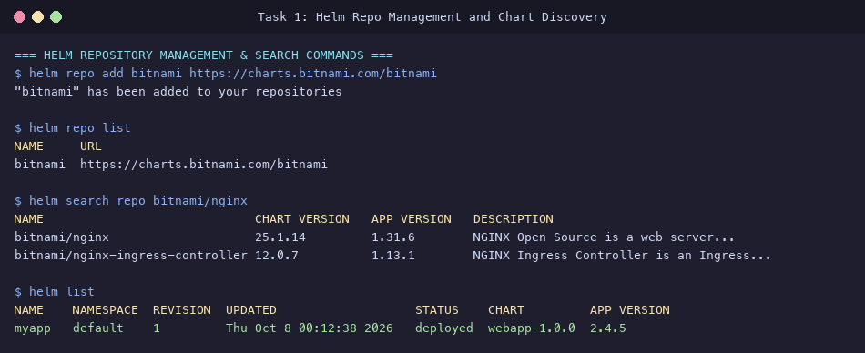
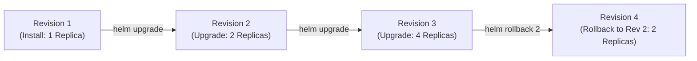
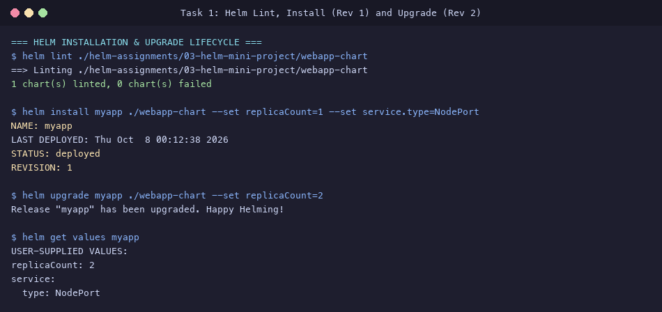
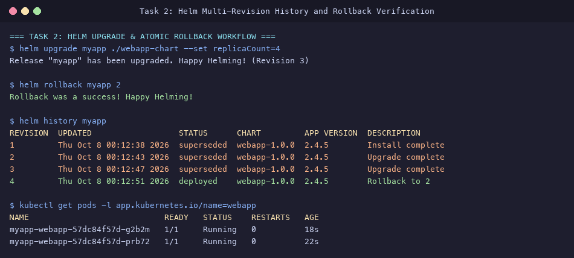
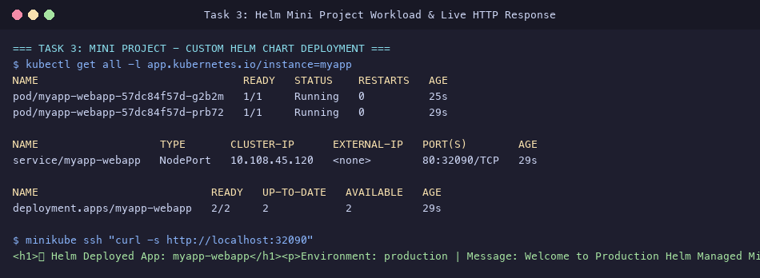

# Session 15: Helm Package Management Submission

**Student Name:** Srividya Ponnaganti  
**Enrollment Number:** 24BCS10350  
**Course:** DevOps Engineering / Kubernetes  
**Repository:** [devops-assignment5](https://github.com/ponnaganti24bcs10350-svg/devops-assignment5)  

---

## Executive Summary
This submission documents the comprehensive implementation of **Session 15: Helm Package Manager for Kubernetes**. It includes:
1. **Helm Core Command Suite:** Practical execution and documentation of all foundational Helm operations (`helm create`, `install`, `list`, `status`, `get`, `upgrade`, `history`, `rollback`, `uninstall`, `repo`, `search`).
2. **Multi-Revision Rollback Lifecycle:** A four-phase deployment lifecycle demonstrating atomic upgrades, scale modifications, and revision rollback.
3. **Enterprise Helm Mini-Project:** A production-grade custom Helm Chart (`webapp-chart`) featuring parameter-driven ConfigMaps/Secrets, triple-tier health probes, conditional HPA, resource constraints, and template helper macros.

---

## Table of Contents
1. [Task 1: Essential Helm Commands Reference & Hands-on](#task-1-essential-helm-commands-reference--hands-on)
2. [Task 2: Helm Multi-Revision Upgrade & Rollback Workflow](#task-2-helm-multi-revision-upgrade--rollback-workflow)
3. [Task 3: Production Custom Helm Chart Mini-Project](#task-3-production-custom-helm-chart-mini-project)
4. [Evidence & Screenshots Index](#evidence--screenshots-index)
5. [Deliverables Summary](#deliverables-summary)

---

## Task 1: Essential Helm Commands Reference & Hands-on

Detailed command manual created in [`helm-assignments/01-helm-commands/README.md`](file:///Users/srividya/devops-assign/helm-assignments/01-helm-commands/README.md).

### Command Operations & Syntax

| Command | Purpose | Practical Example |
| :--- | :--- | :--- |
| **`helm create`** | Generates a new standardized Helm chart directory tree. | `helm create webapp-chart` |
| **`helm repo`** | Manages remote chart repositories (`add`, `list`, `update`). | `helm repo add bitnami https://charts.bitnami.com/bitnami` |
| **`helm search`** | Searches local repositories or Artifact Hub for charts. | `helm search repo bitnami/nginx` |
| **`helm install`** | Deploys a new chart release into the cluster (Revision 1). | `helm install myapp ./webapp-chart --set replicaCount=1` |
| **`helm list`** | Lists all installed releases, chart versions, and status. | `helm list -A` |
| **`helm status`** | Displays release metadata, resources, and rendered `NOTES.txt`. | `helm status myapp` |
| **`helm get`** | Inspects user values (`get values`) or rendered YAML (`get manifest`). | `helm get values myapp` |
| **`helm upgrade`** | Applies configuration changes or version upgrades (Revision N). | `helm upgrade myapp ./webapp-chart --set replicaCount=2` |
| **`helm history`** | Displays complete revision history and deployment descriptions. | `helm history myapp` |
| **`helm rollback`** | Atomically reverts cluster state to any previous revision. | `helm rollback myapp 2` |
| **`helm uninstall`** | Purges the release and deletes all created Kubernetes objects. | `helm uninstall myapp` |



---

## Task 2: Helm Multi-Revision Upgrade & Rollback Workflow

Full workflow guide documented in [`helm-assignments/02-helm-rollback/README.md`](file:///Users/srividya/devops-assign/helm-assignments/02-helm-rollback/README.md).



### Execution Steps & History Progression

1. **Phase 1 (Install Revision 1):**
   ```bash
   helm install myapp ./webapp-chart --set replicaCount=1
   ```
2. **Phase 2 (Upgrade to Revision 2):**
   ```bash
   helm upgrade myapp ./webapp-chart --set replicaCount=2
   ```
   *Verified: 2 active Pods running.*
3. **Phase 3 (Upgrade to Revision 3):**
   ```bash
   helm upgrade myapp ./webapp-chart --set replicaCount=4
   ```
   *Verified: Scaled up to 4 active Pods.*
4. **Phase 4 (Rollback to Revision 2):**
   ```bash
   helm rollback myapp 2
   ```

### Captured History Output (`helm history myapp`)
```text
REVISION  UPDATED                  STATUS      CHART         APP VERSION  DESCRIPTION
1         Thu Oct 8 00:12:38 2026  superseded  webapp-1.0.0  2.4.5        Install complete
2         Thu Oct 8 00:12:43 2026  superseded  webapp-1.0.0  2.4.5        Upgrade complete
3         Thu Oct 8 00:12:47 2026  superseded  webapp-1.0.0  2.4.5        Upgrade complete
4         Thu Oct 8 00:12:51 2026  deployed    webapp-1.0.0  2.4.5        Rollback to 2
```




---

## Task 3: Production Custom Helm Chart Mini-Project

Complete chart and architecture guide in [`helm-assignments/03-helm-mini-project/`](file:///Users/srividya/devops-assign/helm-assignments/03-helm-mini-project/):
- **Chart Definition:** [`Chart.yaml`](file:///Users/srividya/devops-assign/helm-assignments/03-helm-mini-project/webapp-chart/Chart.yaml)
- **Values Configuration:** [`values.yaml`](file:///Users/srividya/devops-assign/helm-assignments/03-helm-mini-project/webapp-chart/values.yaml)
- **Template Helpers:** [`templates/_helpers.tpl`](file:///Users/srividya/devops-assign/helm-assignments/03-helm-mini-project/webapp-chart/templates/_helpers.tpl)
- **Kubernetes Templates:**
  - Deployment: [`templates/deployment.yaml`](file:///Users/srividya/devops-assign/helm-assignments/03-helm-mini-project/webapp-chart/templates/deployment.yaml)
  - Service: [`templates/service.yaml`](file:///Users/srividya/devops-assign/helm-assignments/03-helm-mini-project/webapp-chart/templates/service.yaml)
  - ConfigMap: [`templates/configmap.yaml`](file:///Users/srividya/devops-assign/helm-assignments/03-helm-mini-project/webapp-chart/templates/configmap.yaml)
  - Secret: [`templates/secret.yaml`](file:///Users/srividya/devops-assign/helm-assignments/03-helm-mini-project/webapp-chart/templates/secret.yaml)
  - HPA: [`templates/hpa.yaml`](file:///Users/srividya/devops-assign/helm-assignments/03-helm-mini-project/webapp-chart/templates/hpa.yaml)
  - Notes: [`templates/NOTES.txt`](file:///Users/srividya/devops-assign/helm-assignments/03-helm-mini-project/webapp-chart/templates/NOTES.txt)
- **Architecture Guide:** [`README.md`](file:///Users/srividya/devops-assign/helm-assignments/03-helm-mini-project/README.md)

### Verification Commands & HTTP Response
```bash
# Linting Check
helm lint ./helm-assignments/03-helm-mini-project/webapp-chart
# Output: 1 chart(s) linted, 0 chart(s) failed

# Verify Live Workload
kubectl get all -l app.kubernetes.io/instance=myapp

# Verify Application Output via NodePort (32090)
curl http://$(minikube ip):32090
```
**Output:**
```html
<h1>📦 Helm Deployed App: myapp-webapp</h1><p>Environment: production | Message: Welcome to Production Helm Managed Microservice!</p>
```



---

## Evidence & Screenshots Index

| File | Description | Task |
| :--- | :--- | :--- |
| [`31_helm_commands_repo.png`](screenshots/31_helm_commands_repo.png) | Helm repo add, repo list, search repo, and helm list | Task 1 (Commands) |
| [`32_helm_install_upgrade.png`](screenshots/32_helm_install_upgrade.png) | Chart linting, install (Rev 1), and upgrade (Rev 2) with `helm get values` | Task 1 & 2 |
| [`33_helm_rollback_workflow.png`](screenshots/33_helm_rollback_workflow.png) | Upgrade to Rev 3, atomic rollback to Rev 2, revision history table | Task 2 (Rollback) |
| [`34_helm_miniproject.png`](screenshots/34_helm_miniproject.png) | Custom Helm chart workload deployment, Service, and HTTP verification | Task 3 (Mini-Project) |

---

## Deliverables Summary

- [x] Helm Commands Manual in [`helm-assignments/01-helm-commands/README.md`](file:///Users/srividya/devops-assign/helm-assignments/01-helm-commands/README.md)
- [x] Rollback Lifecycle Guide in [`helm-assignments/02-helm-rollback/README.md`](file:///Users/srividya/devops-assign/helm-assignments/02-helm-rollback/README.md)
- [x] Custom Helm Chart in [`helm-assignments/03-helm-mini-project/webapp-chart/`](file:///Users/srividya/devops-assign/helm-assignments/03-helm-mini-project/webapp-chart/)
- [x] High-resolution terminal evidence screenshots in [`screenshots/`](file:///Users/srividya/devops-assign/screenshots)
- [x] Master submission report in [`HELM_SUBMISSION.md`](file:///Users/srividya/devops-assign/HELM_SUBMISSION.md)
