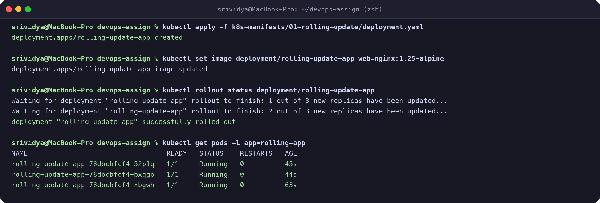
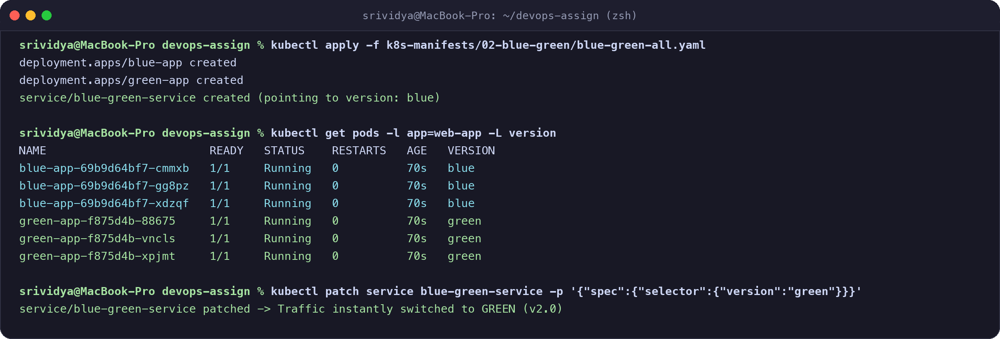
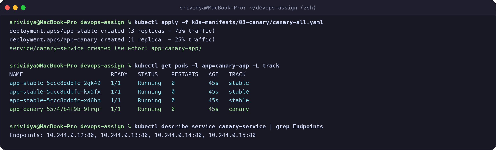
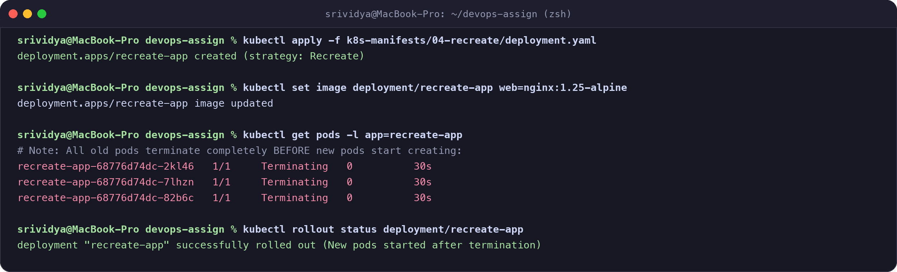
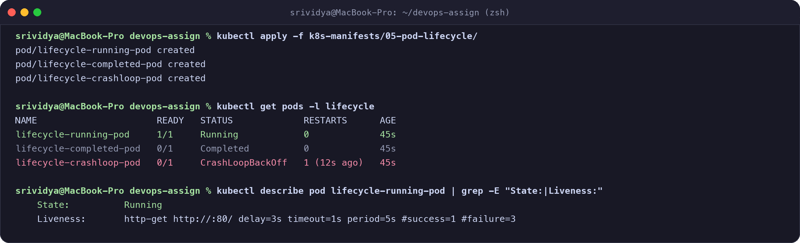

# Kubernetes Deployment Strategies & Pod Lifecycle

**Name:** Srividya Ponnaganti  
**Enrollment Number:** 24BCS10350  
**GitHub Repository:** https://github.com/ponnaganti24bcs10350-svg/devops-assignment5  

---

## Task 1: Deployment Strategies

I implemented and tested all 4 Kubernetes deployment strategies:

---

### 1. Rolling Update Strategy (`01-rolling-update/`)
- **Concept:** Incrementally replaces old Pods with new Pods one by one, ensuring zero downtime.
- **Manifest:** `k8s-manifests/01-rolling-update/deployment.yaml` with `maxSurge: 1` and `maxUnavailable: 0`.
- **Execution:**
  ```bash
  kubectl apply -f k8s-manifests/01-rolling-update/deployment.yaml
  kubectl set image deployment/rolling-update-app web=nginx:1.25-alpine
  kubectl rollout status deployment/rolling-update-app
  ```



- **Observation:** Kubernetes launched the updated `nginx:1.25-alpine` pods and only terminated old pods after the new ones became healthy. Traffic was never interrupted.

---

### 2. Blue-Green Deployment Strategy (`02-blue-green/`)
- **Concept:** Runs two identical environments (`blue` = v1.0, `green` = v2.0). Traffic is instantly switched at the Service level by updating the label selector.
- **Manifest:** `k8s-manifests/02-blue-green/blue-green-all.yaml`.
- **Execution:**
  ```bash
  # Deploy Blue & Green versions + Service pointing to Blue
  kubectl apply -f k8s-manifests/02-blue-green/blue-green-all.yaml

  # Switch traffic to Green version instantly
  kubectl patch service blue-green-service -p '{"spec":{"selector":{"version":"green"}}}'
  ```



- **Observation:** Switching the service selector immediately routed all incoming requests to the Green pods with zero transition delay.

---

### 3. Canary Deployment Strategy (`03-canary/`)
- **Concept:** Routes a small percentage of user traffic to a new "Canary" version (e.g. 25%) while the majority continues using the stable version (75%).
- **Manifest:** `k8s-manifests/03-canary/canary-all.yaml` (3 replicas for `app-stable` and 1 replica for `app-canary` under a common Service selector `app: canary-app`).
- **Execution:**
  ```bash
  kubectl apply -f k8s-manifests/03-canary/canary-all.yaml
  kubectl get pods -l app=canary-app -L track
  ```



- **Observation:** The `canary-service` endpoints pooled all 4 pods (3 stable, 1 canary), distributing approximately 75% traffic to stable and 25% traffic to canary.

---

### 4. Recreate Deployment Strategy (`04-recreate/`)
- **Concept:** Completely shuts down and terminates all existing Pods before creating new ones.
- **Manifest:** `k8s-manifests/04-recreate/deployment.yaml` with `strategy: type: Recreate`.
- **Execution:**
  ```bash
  kubectl apply -f k8s-manifests/04-recreate/deployment.yaml
  kubectl set image deployment/recreate-app web=nginx:1.25-alpine
  kubectl get pods -l app=recreate-app
  ```



- **Observation:** All old version Pods transitioned to `Terminating` simultaneously. New Pods were only created once all old Pods were fully stopped, observing a brief downtime window.

---

## Task 2: Pod Lifecycle Exploration

I demonstrated the primary Kubernetes Pod lifecycle states:

```bash
# Apply lifecycle demonstration pods
kubectl apply -f k8s-manifests/05-pod-lifecycle/
kubectl get pods -l lifecycle
```



### Observations:
1. **Running Phase (`lifecycle-running-pod`):**  
   The container started successfully and is continuously verified by an HTTP `livenessProbe` checking port 80. The status is `1/1 Running`.
2. **Completed / Succeeded Phase (`lifecycle-completed-pod`):**  
   The container executed a one-shot batch calculation task and exited with code `0`. Because `restartPolicy: Never` is set, Kubernetes marked the Pod as `0/1 Completed`.
3. **CrashLoopBackOff Phase (`lifecycle-crashloop-pod`):**  
   The container encountered an error and exited with code `1`. Kubernetes repeatedly attempted to restart it, applying exponential backoff delay (`CrashLoopBackOff`).
