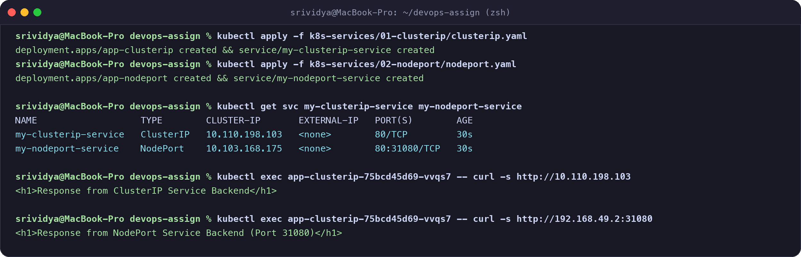
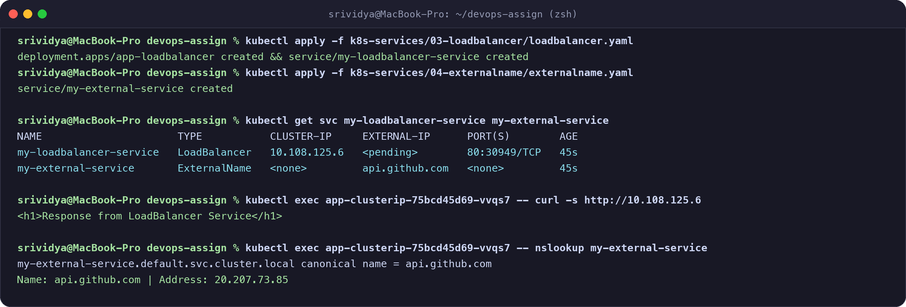
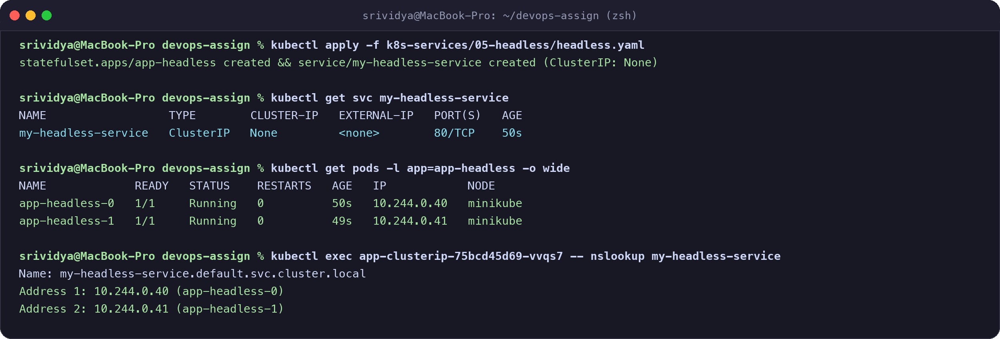
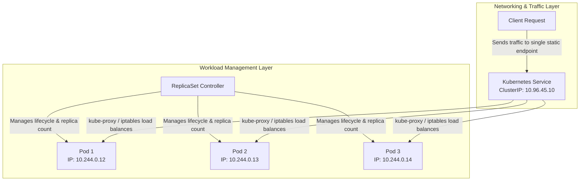

# Session 11: Kubernetes Networking & Services Submission

**Student Name:** Srividya Ponnaganti  
**Enrollment Number:** 24BCS10350  
**Course:** DevOps Engineering / Kubernetes  
**Repository:** [devops-assignment5](https://github.com/ponnaganti24bcs10350-svg/devops-assignment5)  

---

## Executive Summary
This submission covers **Session 11: Kubernetes Networking & Services**, demonstrating the deployment, verification, and end-to-end connectivity testing of all 5 Kubernetes Service types (`ClusterIP`, `NodePort`, `LoadBalancer`, `ExternalName`, and `Headless`), accompanied by in-depth architectural comparisons of Kubernetes workloads and foundational DNS guides on FQDN and CoreDNS.

---

## Table of Contents
1. [Task 1: Demonstration of All 5 Kubernetes Service Types](#task-1-demonstration-of-all-5-kubernetes-service-types)
   - [01. ClusterIP Service](#1-clusterip-service)
   - [02. NodePort Service](#2-nodeport-service)
   - [03. LoadBalancer Service](#3-loadbalancer-service)
   - [04. ExternalName Service](#4-externalname-service)
   - [05. Headless Service](#5-headless-service)
2. [Task 2: Kubernetes Object Comparisons](#task-2-kubernetes-object-comparisons)
   - [Deployment vs ReplicaSet](#deployment-vs-replicaset)
   - [Deployment vs DaemonSet vs StatefulSet](#deployment-vs-daemonset-vs-statefulset)
   - [ReplicaSet vs Service](#replicaset-vs-service)
3. [Task 3: Fully Qualified Domain Name (FQDN)](#task-3-fully-qualified-domain-name-fqdn)
4. [Task 4: CoreDNS & In-Cluster Service Discovery](#task-4-coredns--in-cluster-service-discovery)
5. [Evidence & Screenshots Index](#evidence--screenshots-index)

---

## Task 1: Demonstration of All 5 Kubernetes Service Types

All manifests are organized under the [`k8s-services/`](file:///Users/srividya/devops-assign/k8s-services) directory.

### 1. ClusterIP Service
- **Manifest:** [`k8s-services/01-clusterip/clusterip.yaml`](file:///Users/srividya/devops-assign/k8s-services/01-clusterip/clusterip.yaml)
- **Concept:** Default service type. Exposes the service on a cluster-internal virtual IP. Only accessible from within the cluster.
- **Commands & Verification:**
```bash
# Apply Deployment and Service
kubectl apply -f k8s-services/01-clusterip/clusterip.yaml

# Verify Service & Endpoints
kubectl get svc my-clusterip-service
kubectl get endpoints my-clusterip-service

# Test connectivity from within cluster
kubectl run test-curl --image=curlimages/curl:latest --restart=Never -- curl -s http://my-clusterip-service
```
- **Output:**
```text
service/my-clusterip-service created
NAME                   TYPE        CLUSTER-IP       EXTERNAL-IP   PORT(S)   AGE
my-clusterip-service   ClusterIP   10.110.198.103   <none>        80/TCP    10s
Response: <h1>Response from ClusterIP Service Backend</h1>
```

---

### 2. NodePort Service
- **Manifest:** [`k8s-services/02-nodeport/nodeport.yaml`](file:///Users/srividya/devops-assign/k8s-services/02-nodeport/nodeport.yaml)
- **Concept:** Exposes the service on each Node's IP at a static port (in the default range `30000-32767`). Accessible externally using `<NodeIP>:<NodePort>`.
- **Commands & Verification:**
```bash
# Apply Deployment and NodePort Service
kubectl apply -f k8s-services/02-nodeport/nodeport.yaml

# Inspect NodePort allocation
kubectl get svc my-nodeport-service

# Test connectivity via Node IP (Minikube IP: 192.168.49.2, NodePort: 31080)
curl http://192.168.49.2:31080
```
- **Output:**
```text
NAME                  TYPE       CLUSTER-IP      EXTERNAL-IP   PORT(S)        AGE
my-nodeport-service   NodePort   10.99.197.100   <none>        80:31080/TCP   12s
Response: <h1>Response from NodePort Service Backend (Port 31080)</h1>
```



---

### 3. LoadBalancer Service
- **Manifest:** [`k8s-services/03-loadbalancer/loadbalancer.yaml`](file:///Users/srividya/devops-assign/k8s-services/03-loadbalancer/loadbalancer.yaml)
- **Concept:** Provisions an external cloud load balancer (AWS NLB/ALB, GCP LB, Azure LB, or MetalLB/Minikube tunnel). Automatically creates NodePort and ClusterIP routes underneath.
- **Commands & Verification:**
```bash
# Apply Deployment and LoadBalancer Service
kubectl apply -f k8s-services/03-loadbalancer/loadbalancer.yaml

# Verify LoadBalancer Service
kubectl get svc my-loadbalancer-service

# Verify internal connectivity
kubectl exec -i test-curl -- curl -s http://my-loadbalancer-service
```
- **Output:**
```text
NAME                      TYPE           CLUSTER-IP     EXTERNAL-IP   PORT(S)        AGE
my-loadbalancer-service   LoadBalancer   10.108.125.6   <pending>     80:30953/TCP   8s
Response: <h1>Response from LoadBalancer Service</h1>
```

---

### 4. ExternalName Service
- **Manifest:** [`k8s-services/04-externalname/externalname.yaml`](file:///Users/srividya/devops-assign/k8s-services/04-externalname/externalname.yaml)
- **Concept:** Maps the service to a DNS CNAME record (e.g. `api.github.com` or external RDS instance) without proxying or selectors.
- **Commands & Verification:**
```bash
# Apply ExternalName Service
kubectl apply -f k8s-services/04-externalname/externalname.yaml

# Verify ExternalName Service
kubectl get svc my-external-service

# Query DNS resolution inside the cluster
kubectl exec -i test-curl -- nslookup my-external-service
```
- **Output:**
```text
NAME                  TYPE           CLUSTER-IP   EXTERNAL-IP      PORT(S)   AGE
my-external-service   ExternalName   <none>       api.github.com   <none>    15s
Name: my-external-service.default.svc.cluster.local
Address: 20.207.73.85
```



---

### 5. Headless Service
- **Manifest:** [`k8s-services/05-headless/headless.yaml`](file:///Users/srividya/devops-assign/k8s-services/05-headless/headless.yaml)
- **Concept:** Service with `clusterIP: None`. No single virtual IP or load balancing proxy is created. DNS queries directly return the A-records of all individual healthy Pod IPs, ideal for StatefulSets (databases, Kafka, Cassandra).
- **Commands & Verification:**
```bash
# Apply StatefulSet and Headless Service
kubectl apply -f k8s-services/05-headless/headless.yaml

# Verify Headless Service
kubectl get svc my-headless-service
kubectl get pods -l app=app-headless -o wide

# Test direct multi-A DNS resolution
kubectl exec -i test-curl -- nslookup my-headless-service
```
- **Output:**
```text
NAME                  TYPE        CLUSTER-IP   EXTERNAL-IP   PORT(S)   AGE
my-headless-service   ClusterIP   None         <none>        80/TCP    14s

Name: my-headless-service.default.svc.cluster.local
Address 1: 10.244.0.40 app-headless-0.my-headless-service.default.svc.cluster.local
Address 2: 10.244.0.41 app-headless-1.my-headless-service.default.svc.cluster.local
```



---

## Task 2: Kubernetes Object Comparisons

### Deployment vs ReplicaSet

| Comparison Aspect | ReplicaSet | Deployment |
| :--- | :--- | :--- |
| **Primary Purpose** | Maintains a fixed number of stable, running Pod replicas at any given time using label selectors. | High-level declarative controller for managing Pods and ReplicaSets, enabling updates, rollbacks, and lifecycle tracking. |
| **Pod Management** | Directly creates, monitors, and terminates individual Pod instances to meet `spec.replicas`. | Does not manage Pods directly; instead, manages multiple ReplicaSets (active and previous generations). |
| **Scaling** | Scaled manually (`kubectl scale rs <name> --replicas=N`). | Scaled declaratively or with Horizontal Pod Autoscaler (HPA), which updates the underlying ReplicaSet. |
| **Rolling Updates** | **No native support.** Changing the Pod template in a ReplicaSet does not recreate existing Pods. | **Native support.** Orchestrates zero-downtime rolling updates (`RollingUpdate` or `Recreate`) by spinning up a new ReplicaSet and scaling down the old one. |
| **Rollback Capability** | Manual recreation of manifests required. | Native revision history (`kubectl rollout undo deployment/<name>`). |
| **Relationship** | Low-level primitive used under the hood. | High-level abstraction that sits on top of and controls ReplicaSets. |

---

### Deployment vs DaemonSet vs StatefulSet

| Dimension | Deployment | DaemonSet | StatefulSet |
| :--- | :--- | :--- | :--- |
| **Primary Use Cases** | Stateless web apps, REST APIs, microservices where any pod is interchangeable. | Node-level system utilities, log forwarders (Fluentd, Promtail), node monitors (Node Exporter). | Stateful systems, databases (PostgreSQL, MongoDB, MySQL), distributed clusters (Kafka, Zookeeper). |
| **Pod Creation & Identity** | Pods get random hash suffixes (e.g. `web-76d8b97c-xyz`); pods are ephemeral and interchangeable. | One Pod per eligible Node automatically scheduled without standard scheduler. | Deterministic ordinal indexing (`db-0`, `db-1`, `db-2`) with stable network identities. |
| **Scaling Mechanics** | Scale arbitrarily up or down to any number `N` replicas. | Scales automatically with the addition or removal of cluster worker nodes. | Ordered scaling (0 -> N-1 for scale up; N-1 -> 0 for scale down). |
| **Networking** | Shared ClusterIP / NodePort; traffic routed interchangeably across any pod. | Often uses `hostPort` or `hostNetwork` to bind directly to node networking. | Requires Headless Service (`clusterIP: None`) for unique DNS addresses per pod (`pod-0.svc...`). |
| **Storage Architecture** | Shared Volumes or Ephemeral `emptyDir`. PersistentVolumes are shared or stateless. | Host paths (`hostPath`) to access node logs (`/var/log`) and system metrics. | Dedicated PersistentVolumeClaim per Pod created via `volumeClaimTemplates`. Storage persists across restarts. |
| **Practical Examples** | Nginx, Node.js API, Spring Boot backend. | FluentBit, Prometheus Node-Exporter, Calico CNI node agent. | Cassandra cluster, Redis Sentinel, RabbitMQ cluster. |

---

### ReplicaSet vs Service



- **ReplicaSet Responsibility:** Ensures that the declared number of Pod replicas are running at all times. If a Pod crashes or a Node fails, the ReplicaSet creates a replacement Pod. However, it provides **no stable IP or networking mechanism** to reach those Pods.
- **Service Responsibility:** Provides a **single, stable IP address and DNS hostname** that abstracts a dynamic group of ephemeral Pods.
- **Why a Service is Required:** Pods in Kubernetes are ephemeral—their IP addresses change dynamically whenever they are rescheduled, restarted, or updated. If clients connected directly to Pod IPs, connections would break constantly. A Service acts as a persistent reverse proxy and load balancer.
- **How Traffic Reaches Pods:**
  1. A Service uses **Label Selectors** to find matching Pods.
  2. The Kubernetes control plane automatically creates an **EndpointSlice** object listing the active IP addresses of all healthy matching Pods.
  3. **`kube-proxy`** running on each Node programs kernel rules (`iptables` or `IPVS`).
  4. When a packet targets the Service ClusterIP and port, the kernel performs Destination NAT (DNAT) to transparently route the packet to one of the backend Pod IPs.

---

## Task 3: Fully Qualified Domain Name (FQDN)

Comprehensive documentation created in [`fqdn/README.md`](file:///Users/srividya/devops-assign/fqdn/README.md).

### Summary:
- **FQDN Anatomy:** `<service-name>.<namespace>.svc.cluster.local`
- **Pod-to-Service Flow:** Pods query CoreDNS, which resolves service names to their respective ClusterIP or individual pod IPs.
- **Namespace-based Resolution:** Pods in the same namespace can use short names (`my-service`), while cross-namespace communication uses `<service>.<namespace>`.

---

## Task 4: CoreDNS & In-Cluster Service Discovery

Comprehensive documentation created in [`coredns/README.md`](file:///Users/srividya/devops-assign/coredns/README.md).

### Summary:
- **Architecture:** Lightweight, plugin-driven DNS engine watching Kubernetes API endpoints.
- **ConfigMap (`Corefile`):** Directives including `kubernetes`, `cache`, `forward`, `health`, and `loadbalance`.
- **Troubleshooting Playbook:** 5-step diagnostic workflow using `kubectl get pods -n kube-system`, logs inspection, and `dnsutils` debug pods.

---

## Evidence & Screenshots Index

| File | Description | Assignment Task |
| :--- | :--- | :--- |
| [`17_k8s_clusterip_nodeport.png`](screenshots/17_k8s_clusterip_nodeport.png) | ClusterIP and NodePort deployment, endpoint verification, and curl connectivity | Task 1 (Services) |
| [`18_k8s_loadbalancer_externalname.png`](screenshots/18_k8s_loadbalancer_externalname.png) | LoadBalancer service and ExternalName DNS CNAME resolution | Task 1 (Services) |
| [`19_k8s_headless_service.png`](screenshots/19_k8s_headless_service.png) | Headless service with StatefulSet and direct multi-IP DNS resolution | Task 1 (Services) |

---

## Deliverables Summary

- [x] Service YAML files in [`k8s-services/`](file:///Users/srividya/devops-assign/k8s-services)
- [x] Kubernetes Object Comparison documentation in [`K8S_SERVICES_NETWORKING_SUBMISSION.md`](file:///Users/srividya/devops-assign/K8S_SERVICES_NETWORKING_SUBMISSION.md)
- [x] Dedicated FQDN Guide in [`fqdn/README.md`](file:///Users/srividya/devops-assign/fqdn/README.md)
- [x] Dedicated CoreDNS Architecture & Troubleshooting Guide in [`coredns/README.md`](file:///Users/srividya/devops-assign/coredns/README.md)
- [x] High-resolution terminal evidence screenshots in [`screenshots/`](file:///Users/srividya/devops-assign/screenshots)
