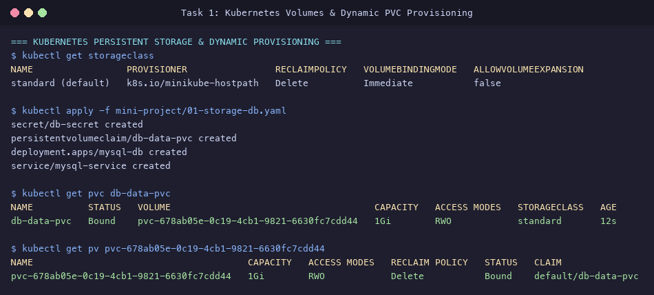
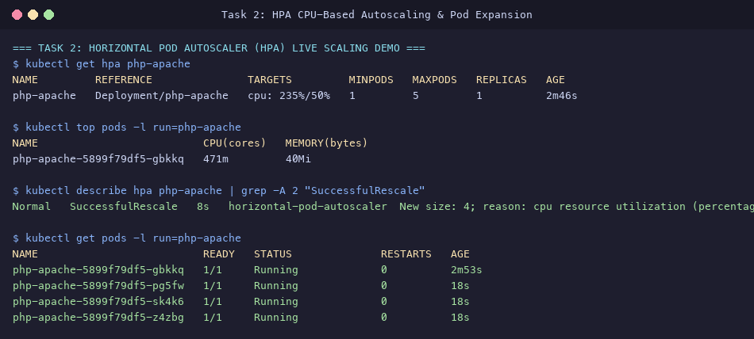
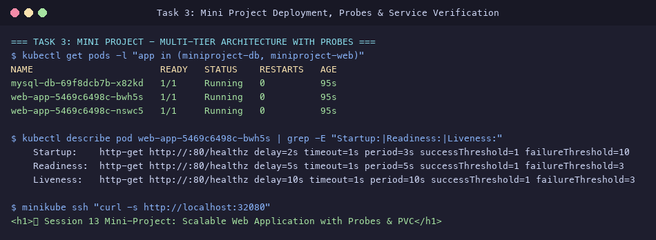

# Session 13: Kubernetes Storage, HPA & Probes Submission

**Student Name:** Srividya Ponnaganti  
**Enrollment Number:** 24BCS10350  
**Course:** DevOps Engineering / Kubernetes  
**Repository:** [devops-assignment5](https://github.com/ponnaganti24bcs10350-svg/devops-assignment5)  

---

## Executive Summary
This submission documents the comprehensive implementation of **Session 13: Kubernetes Storage, HPA & Probes**. It encompasses:
1. **In-depth Kubernetes Storage Architecture:** Detailed analysis and YAML implementations of `emptyDir`, `hostPath`, `PersistentVolume` (PV), `PersistentVolumeClaim` (PVC), `StorageClass`, and Dynamic Volume Provisioning.
2. **Horizontal Pod Autoscaling (HPA) Hands-on:** Deployment of resource-constrained services, Metrics Server integration, intensive load generation, and live observation of CPU-driven autoscaling from 1 to 4 replicas.
3. **Session 13 Mini-Project:** An enterprise multi-tier architecture uniting durable database storage via PVC, triple-tier health probes (**Startup**, **Readiness**, and **Liveness**), decoupled ConfigMaps/Secrets, and HPA autoscaling.

---

## Table of Contents
1. [Task 1: Kubernetes Storage & Volumes Deep Dive](#task-1-kubernetes-storage--volumes-deep-dive)
2. [Task 2: Horizontal Pod Autoscaler (HPA) Hands-on](#task-2-horizontal-pod-autoscaler-hpa-hands-on)
3. [Task 3: Production Mini-Project Implementation](#task-3-production-mini-project-implementation)
4. [Evidence & Screenshots Index](#evidence--screenshots-index)
5. [Deliverables Summary](#deliverables-summary)

---

## Task 1: Kubernetes Storage & Volumes Deep Dive

Comprehensive documentation is available in [`01-kubernetes-volumes/README.md`](file:///Users/srividya/devops-assign/01-kubernetes-volumes/README.md).

### Core Storage Concepts

```mermaid
flowchart TD
    subgraph StorageInfra ["Cluster Storage Layer"]
        SC[StorageClass: standard]
        PV[PersistentVolume: 1Gi RWO]
        SC -->|Dynamic Provisioning| PV
    end

    subgraph AppScope ["Application Namespace"]
        PVC[PersistentVolumeClaim: db-data-pvc]
        Pod[MySQL Database Pod]
        Mount["VolumeMount: /var/lib/mysql"]
        
        PVC -->|Binds (1:1)| PV
        Pod --> PVC
        Pod --> Mount
    end
```

1. **`emptyDir`:** Temporary scratchpad created when a Pod is scheduled to a Node. Useful for caching, sidecar file sharing, or ephemeral sorting space.
2. **`hostPath`:** Mounts files/directories directly from the host Node's filesystem (e.g. `/var/log` for node logging agents).
3. **`PersistentVolume` (PV):** Cluster-scoped storage resource provisioned statically by an admin or dynamically by a StorageClass.
4. **`PersistentVolumeClaim` (PVC):** A user's declarative request for storage specifying capacity, access modes (`ReadWriteOnce`, `ReadOnlyMany`, `ReadWriteMany`), and storage classes.
5. **`StorageClass` & Dynamic Provisioning:** Enables on-demand volume provisioning via CSI plugins (e.g., Minikube HostPath provisioner, AWS EBS, GCP PD) without manual intervention.

### Verification of Dynamic PVC Binding
```bash
$ kubectl get pvc db-data-pvc
NAME          STATUS   VOLUME                                     CAPACITY   ACCESS MODES   STORAGECLASS   AGE
db-data-pvc   Bound    pvc-678ab05e-0c19-4cb1-9821-6630fc7cdd44   1Gi        RWO            standard       12s
```



---

## Task 2: Horizontal Pod Autoscaler (HPA) Hands-on

Manifests located in [`02-hpa/`](file:///Users/srividya/devops-assign/02-hpa/):
- Deployment: [`02-hpa/app-deployment.yaml`](file:///Users/srividya/devops-assign/02-hpa/app-deployment.yaml) (requests: 200m CPU, limits: 500m CPU)
- HPA: [`02-hpa/hpa.yaml`](file:///Users/srividya/devops-assign/02-hpa/hpa.yaml) (Target: 50% CPU utilization, Min: 1, Max: 5)
- Load Generator: [`02-hpa/load-generator.yaml`](file:///Users/srividya/devops-assign/02-hpa/load-generator.yaml)
- Step-by-Step Guide: [`02-hpa/README.md`](file:///Users/srividya/devops-assign/02-hpa/README.md)

### Step-by-Step Commands & Observed Results

1. **Enable Metrics Server:**
   ```bash
   minikube addons enable metrics-server
   ```
2. **Deploy Application and HPA:**
   ```bash
   kubectl apply -f 02-hpa/app-deployment.yaml
   kubectl apply -f 02-hpa/hpa.yaml
   ```
3. **Inject Heavy HTTP Load:**
   ```bash
   kubectl apply -f 02-hpa/load-generator.yaml
   ```
4. **Observe Real-Time Metrics & Pod Autoscaling:**
   ```bash
   kubectl top pods -l run=php-apache
   kubectl get hpa php-apache
   kubectl describe hpa php-apache
   kubectl get pods -l run=php-apache
   ```

### Output Evidence
- **CPU Spike:** `471m` consumed on the active pod, pushing CPU utilization to **235%** (threshold: 50%).
- **Autoscaling Event:** `Normal SuccessfulRescale: New size: 4; reason: cpu resource utilization above target`.
- **Pod Expansion:** Scaled dynamically from 1 to 4 active running Pods (`php-apache-5899f79df5-gbkkq`, `pg5fw`, `sk4k6`, `z4zbg`).



---

## Task 3: Production Mini-Project Implementation

Full project manifests and documentation located in [`mini-project/`](file:///Users/srividya/devops-assign/mini-project/):
- Database Layer: [`mini-project/01-storage-db.yaml`](file:///Users/srividya/devops-assign/mini-project/01-storage-db.yaml)
- Web App Layer with Probes: [`mini-project/02-app-probes.yaml`](file:///Users/srividya/devops-assign/mini-project/02-app-probes.yaml)
- Web App Autoscaler: [`mini-project/03-app-hpa.yaml`](file:///Users/srividya/devops-assign/mini-project/03-app-hpa.yaml)
- Architectural Guide: [`mini-project/README.md`](file:///Users/srividya/devops-assign/mini-project/README.md)

### Architecture Highlights

```mermaid
flowchart LR
    Client[Incoming Request] --> Service[web-app-service :32080]
    Service --> WebPods[web-app Pods<br/>• Startup Probe (/healthz)<br/>• Readiness Probe (/healthz)<br/>• Liveness Probe (/healthz)]
    WebPods --> DBService[mysql-service :3306]
    DBService --> DBPod[mysql-db Pod]
    DBPod --> PVC[PVC: db-data-pvc 1Gi]
```

### Health Probes Implementation & Verification

1. **Startup Probe (`httpGet: /healthz`):**
   - Configured with `failureThreshold: 10` and `periodSeconds: 3` (up to 30 seconds of grace period).
   - Allows slow application boots without triggering premature container restarts.
2. **Readiness Probe (`httpGet: /healthz`):**
   - Configured with `periodSeconds: 5` and `failureThreshold: 3`.
   - Ensures zero traffic hits the pod until initialization completes.
3. **Liveness Probe (`httpGet: /healthz`):**
   - Configured with `periodSeconds: 10` and `failureThreshold: 3`.
   - Detects frozen application threads and automatically triggers container restart.

### Verification Commands & Results
```bash
# Verify Pods & Probes
kubectl get pods -l "app in (miniproject-db, miniproject-web)"
kubectl describe pod -l app=miniproject-web | grep -E "Startup:|Readiness:|Liveness:"

# Test HTTP Service Response
curl http://$(minikube ip):32080
```
**Response:**
```html
<h1>🚀 Session 13 Mini-Project: Scalable Web Application with Probes & PVC</h1>
```



---

## Evidence & Screenshots Index

| File | Description | Assignment Task |
| :--- | :--- | :--- |
| [`24_k8s_volumes.png`](screenshots/24_k8s_volumes.png) | StorageClass, PersistentVolumeClaim dynamic binding to PersistentVolume | Task 1 (Storage) |
| [`25_k8s_hpa_scaling.png`](screenshots/25_k8s_hpa_scaling.png) | HPA CPU load spike (235%), SuccessfulRescale event, and scale-up to 4 Pods | Task 2 (HPA) |
| [`26_k8s_probes_miniproject.png`](screenshots/26_k8s_probes_miniproject.png) | Multi-tier Mini Project, Startup/Readiness/Liveness probes, and live HTTP verification | Task 3 (Mini-Project) |

---

## Deliverables Summary

- [x] Kubernetes Volume Guide in [`01-kubernetes-volumes/README.md`](file:///Users/srividya/devops-assign/01-kubernetes-volumes/README.md)
- [x] HPA Manifests and Walkthrough in [`02-hpa/`](file:///Users/srividya/devops-assign/02-hpa/)
- [x] Complete Mini-Project in [`mini-project/`](file:///Users/srividya/devops-assign/mini-project/)
- [x] High-resolution terminal evidence screenshots in [`screenshots/`](file:///Users/srividya/devops-assign/screenshots)
- [x] Master submission report in [`K8S_STORAGE_HPA_PROBES_SUBMISSION.md`](file:///Users/srividya/devops-assign/K8S_STORAGE_HPA_PROBES_SUBMISSION.md)
