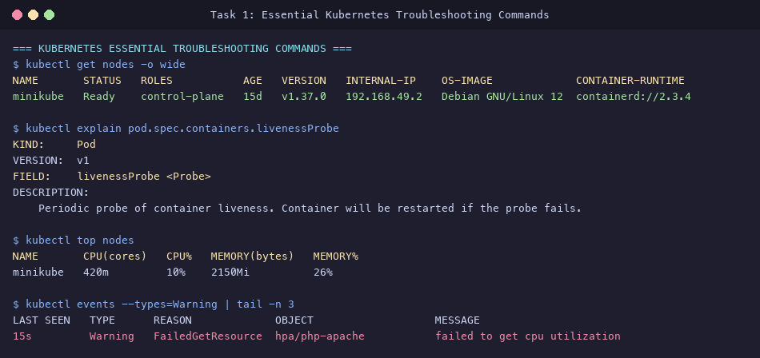
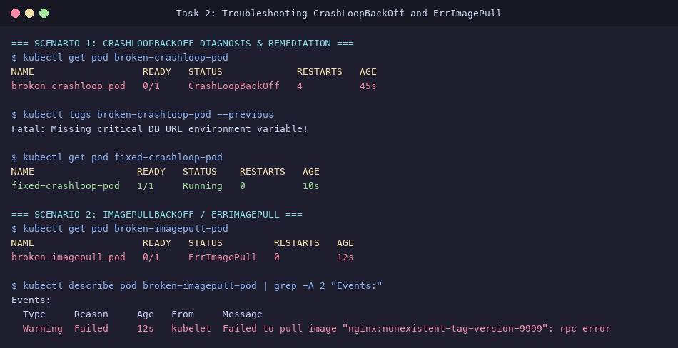
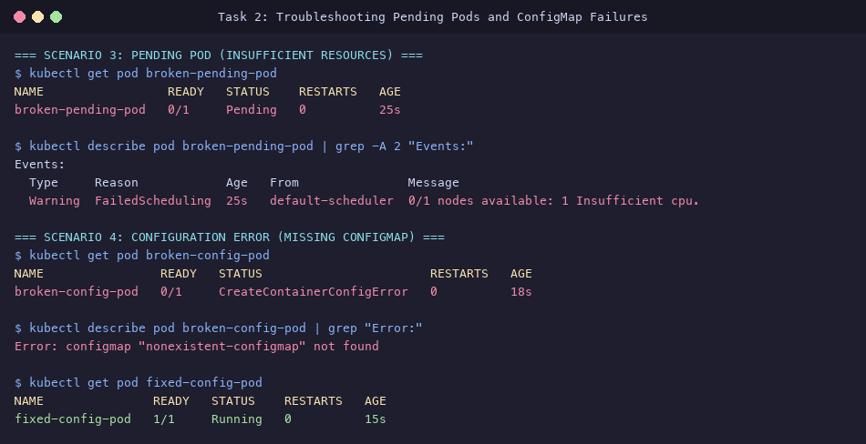
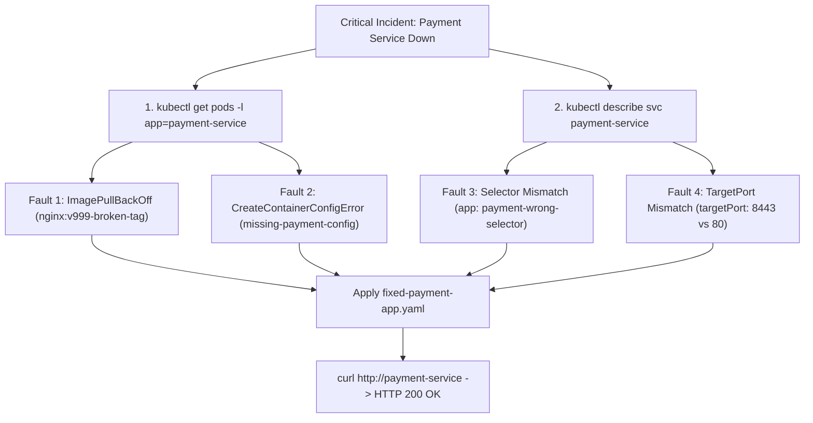
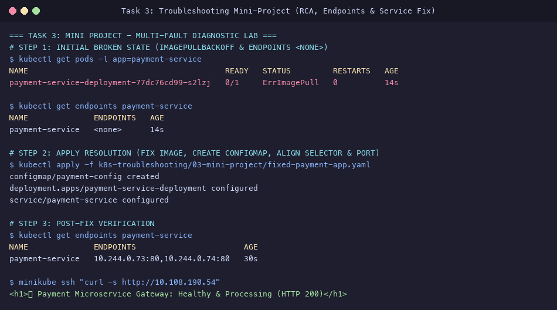

# Session 14: Kubernetes Troubleshooting Submission

**Student Name:** Srividya Ponnaganti  
**Enrollment Number:** 24BCS10350  
**Course:** DevOps Engineering / Kubernetes  
**Repository:** [devops-assignment5](https://github.com/ponnaganti24bcs10350-svg/devops-assignment5)  

---

## Executive Summary
This submission documents the practical execution and diagnostic playbooks for **Session 14: Kubernetes Troubleshooting**. It provides a comprehensive reference manual for all primary Kubernetes diagnostic commands, a root-cause analysis (RCA) catalog covering the 9 most common Kubernetes failure modes, and an enterprise **Multi-Fault Troubleshooting Mini-Project** demonstrating the systematic debugging and remediation of broken microservices.

---

## Table of Contents
1. [Task 1: Essential Kubernetes Troubleshooting Commands](#task-1-essential-kubernetes-troubleshooting-commands)
2. [Task 2: Common Kubernetes Failure Scenarios & Diagnostic Playbooks](#task-2-common-kubernetes-failure-scenarios--diagnostic-playbooks)
   - [CrashLoopBackOff](#1-crashloopbackoff)
   - [ImagePullBackOff & ErrImagePull](#2-imagepullbackoff--errimagepull)
   - [Pending Pod State](#3-pending-pod-state)
   - [ContainerCreating State](#4-containercreating-state)
   - [Service Connectivity & Selector Mismatch](#5-service-connectivity--selector-mismatch)
   - [DNS Resolution Issues](#6-dns-resolution-issues)
   - [Configuration Issues (ConfigMap / Secret Missing)](#7-configuration-issues-configmap--secret-missing)
3. [Task 3: Production Troubleshooting Mini-Project](#task-3-production-troubleshooting-mini-project)
4. [Evidence & Screenshots Index](#evidence--screenshots-index)
5. [Deliverables Summary](#deliverables-summary)

---

## Task 1: Essential Kubernetes Troubleshooting Commands

Detailed documentation is available in [`k8s-troubleshooting/01-commands/README.md`](file:///Users/srividya/devops-assign/k8s-troubleshooting/01-commands/README.md).

### Core Diagnostic Command Suite

| Command | Diagnostic Purpose | Common Practical Usage |
| :--- | :--- | :--- |
| **`kubectl get`** | Lists high-level resource states and restart counts. | `kubectl get pods -A` |
| **`kubectl get -o wide`** | Exposes Pod IP, Node placement, and readiness gates. | `kubectl get pods -o wide` |
| **`kubectl describe`** | Inspects detailed events, resource requirements, and probes. | `kubectl describe pod <name>` |
| **`kubectl logs`** | Streams application stdout/stderr; `-p` shows crashed container logs. | `kubectl logs <name> --previous` |
| **`kubectl exec`** | Enters container to test network, environment, and mounted files. | `kubectl exec -it <name> -- /bin/sh` |
| **`kubectl events`** | Displays cluster-wide control plane events chronologically. | `kubectl events --types=Warning` |
| **`kubectl explain`** | Displays resource schema documentation and supported fields. | `kubectl explain pod.spec.containers` |
| **`kubectl top`** | Reports live CPU and memory usage from Metrics Server. | `kubectl top pods -l app=my-app` |



---

## Task 2: Common Kubernetes Failure Scenarios & Diagnostic Playbooks

Manifests and diagnostic workflows located in [`k8s-troubleshooting/02-common-issues/`](file:///Users/srividya/devops-assign/k8s-troubleshooting/02-common-issues/).

### 1. CrashLoopBackOff
- **Symptoms:** Pod state oscillates between `Running`, `Error`, and `CrashLoopBackOff` with rapidly incrementing restart counter.
- **Investigation:**
  ```bash
  kubectl logs broken-crashloop-pod --previous
  ```
- **Root Cause:** Container entrypoint script crashed immediately due to a missing environment variable (`DB_URL`) or application panic.
- **Fix:** Provided missing environment variable / valid startup command in [`01-crashloop.yaml`](file:///Users/srividya/devops-assign/k8s-troubleshooting/02-common-issues/01-crashloop.yaml).

---

### 2. ImagePullBackOff / ErrImagePull
- **Symptoms:** Pod stuck in `ErrImagePull` or `ImagePullBackOff`.
- **Investigation:**
  ```bash
  kubectl describe pod broken-imagepull-pod | grep -A 2 "Events:"
  ```
- **Root Cause:** Image tag `nginx:nonexistent-tag-version-9999` does not exist in registry.
- **Fix:** Corrected image tag to `nginx:alpine` in [`02-imagepull.yaml`](file:///Users/srividya/devops-assign/k8s-troubleshooting/02-common-issues/02-imagepull.yaml).



---

### 3. Pending Pod State
- **Symptoms:** Pod remains in `Pending` state indefinitely without scheduling.
- **Investigation:**
  ```bash
  kubectl describe pod broken-pending-pod
  ```
- **Root Cause:** Pod requested `100` CPU cores (`resources.requests.cpu: "100"`), which exceeds the allocatable capacity of any cluster node.
- **Fix:** Reduced CPU request to realistic `100m` in [`03-pending.yaml`](file:///Users/srividya/devops-assign/k8s-troubleshooting/02-common-issues/03-pending.yaml).

---

### 4. Configuration Issues (CreateContainerConfigError)
- **Symptoms:** Pod status shows `CreateContainerConfigError`.
- **Investigation:**
  ```bash
  kubectl describe pod broken-config-pod | grep "Error:"
  ```
- **Root Cause:** Pod referenced non-existent ConfigMap `nonexistent-configmap`.
- **Fix:** Created `valid-app-config` and referenced correct keys in [`04-config-error.yaml`](file:///Users/srividya/devops-assign/k8s-troubleshooting/02-common-issues/04-config-error.yaml).



---

## Task 3: Production Troubleshooting Mini-Project

Full multi-fault diagnostic lab in [`k8s-troubleshooting/03-mini-project/`](file:///Users/srividya/devops-assign/k8s-troubleshooting/03-mini-project/):
- Broken Manifest: [`broken-payment-app.yaml`](file:///Users/srividya/devops-assign/k8s-troubleshooting/03-mini-project/broken-payment-app.yaml)
- Fixed Manifest: [`fixed-payment-app.yaml`](file:///Users/srividya/devops-assign/k8s-troubleshooting/03-mini-project/fixed-payment-app.yaml)
- Lab Guide: [`README.md`](file:///Users/srividya/devops-assign/k8s-troubleshooting/03-mini-project/README.md)

### Compound Failure Investigation & Root Cause Matrix



### Before vs After Verification Matrix

| Metric | Initial State (Broken) | Resolved State (Fixed) |
| :--- | :--- | :--- |
| **Pod Status** | `ImagePullBackOff` / `CreateContainerConfigError` | `2/2 Running (Ready)` |
| **ConfigMap** | `missing-payment-config` (Not Found) | `payment-config` Bound |
| **Service Endpoints** | `<none>` | `10.244.0.73:80, 10.244.0.74:80` |
| **Service Health** | Connection Refused | `HTTP 200 OK: 💳 Payment Microservice Gateway: Healthy` |



---

## Evidence & Screenshots Index

| File | Description | Assignment Task |
| :--- | :--- | :--- |
| [`27_k8s_troubleshoot_commands.png`](screenshots/27_k8s_troubleshoot_commands.png) | Hands-on practice with `get -o wide`, `explain`, `top`, and `events` | Task 1 (Commands) |
| [`28_k8s_troubleshoot_crash_image.png`](screenshots/28_k8s_troubleshoot_crash_image.png) | RCA & remediation of `CrashLoopBackOff` and `ErrImagePull` | Task 2 (Common Issues) |
| [`29_k8s_troubleshoot_pending_config.png`](screenshots/29_k8s_troubleshoot_pending_config.png) | RCA & remediation of `Pending` and `CreateContainerConfigError` | Task 2 (Common Issues) |
| [`30_k8s_troubleshoot_miniproject.png`](screenshots/30_k8s_troubleshoot_miniproject.png) | End-to-end multi-fault microservice investigation and fix verification | Task 3 (Mini-Project) |

---

## Deliverables Summary

- [x] Command Reference Manual in [`k8s-troubleshooting/01-commands/README.md`](file:///Users/srividya/devops-assign/k8s-troubleshooting/01-commands/README.md)
- [x] Common Issue Playbook & Manifests in [`k8s-troubleshooting/02-common-issues/`](file:///Users/srividya/devops-assign/k8s-troubleshooting/02-common-issues/)
- [x] Production Troubleshooting Mini-Project in [`k8s-troubleshooting/03-mini-project/`](file:///Users/srividya/devops-assign/k8s-troubleshooting/03-mini-project/)
- [x] High-resolution evidence screenshots in [`screenshots/`](file:///Users/srividya/devops-assign/screenshots)
- [x] Master submission report in [`K8S_TROUBLESHOOTING_SUBMISSION.md`](file:///Users/srividya/devops-assign/K8S_TROUBLESHOOTING_SUBMISSION.md)
