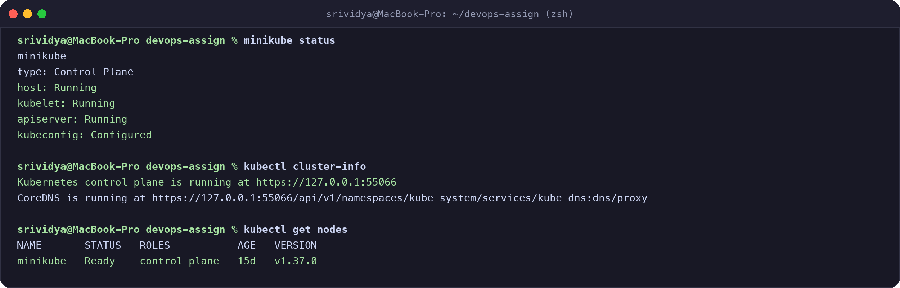
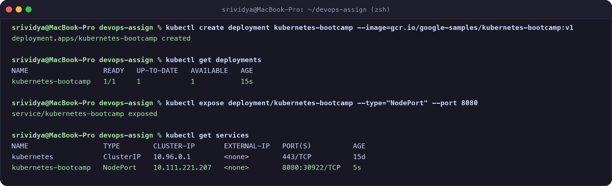
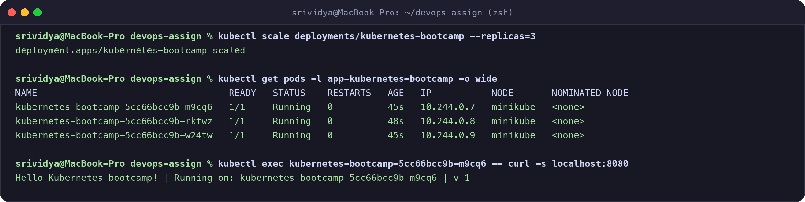

# Kubernetes Fundamentals & Minikube Hands-on

**Name:** Srividya Ponnaganti  
**Enrollment Number:** 24BCS10350  
**GitHub Repository:** https://github.com/ponnaganti24bcs10350-svg/devops-assignment5  

---

## 1. Minikube Setup & Cluster Status

I configured Minikube and verified the cluster status using `kubectl` and `minikube`:

```bash
# Check Minikube status
minikube status

# Check Kubernetes control plane info
kubectl cluster-info

# Check cluster nodes
kubectl get nodes
```



- **Cluster Node:** `minikube` (Control-plane, Ready, v1.37.0)
- **Control Plane Status:** Running and accessible at `https://127.0.0.1:55066`

---

## 2. Kubernetes Architecture Notes

A Kubernetes cluster consists of two main layers: the **Control Plane** (managing the cluster state) and **Worker Nodes** (running containerized applications).

```
                      +---------------------------------------+
                      |             Control Plane             |
                      |  +---------------------------------+  |
                      |  |         kube-apiserver          |  |
                      |  +----+--------------+-------------+  |
                      |       |              |                |
                      |  +----+-----+  +-----+-----------+    |
                      |  |   etcd   |  | kube-scheduler  |    |
                      |  +----------+  +-----------------+    |
                      |  +-------------------------------+    |
                      |  |    kube-controller-manager    |    |
                      |  +-------------------------------+    |
                      +-------------------+-------------------+
                                          |
                     +--------------------+--------------------+
                     |                                         |
        +------------v------------+               +------------v------------+
        |       Worker Node 1     |               |       Worker Node 2     |
        |  +-------------------+  |               |  +-------------------+  |
        |  |      kubelet      |  |               |  |      kubelet      |  |
        |  +-------------------+  |               |  +-------------------+  |
        |  |    kube-proxy     |  |               |  |    kube-proxy     |  |
        |  +-------------------+  |               |  +-------------------+  |
        |  | Container Runtime |  |               |  | Container Runtime |  |
        |  | (Pod A)   (Pod B) |  |               |  | (Pod C)   (Pod D) |  |
        |  +-------------------+  |               |  +-------------------+  |
        +-------------------------+               +-------------------------+
```

### Control Plane Components:
1. **kube-apiserver:** The central entry point and REST API gateway for the entire cluster. All internal components and `kubectl` communicate through the API server.
2. **etcd:** Consistent, highly-available distributed key-value store containing all cluster state, secrets, and configuration data.
3. **kube-scheduler:** Watches for newly created Pods with no assigned node and assigns them to an optimal worker node based on resource requirements.
4. **kube-controller-manager:** Runs core controller background processes (e.g., Node Controller, ReplicaSet Controller, Deployment Controller) to continuously reconcile the actual cluster state with the desired state.

### Worker Node Components:
1. **kubelet:** An agent running on each worker node that ensures containers described in PodSpecs are running and healthy.
2. **kube-proxy:** A network proxy that maintains network rules on nodes, enabling communication to Pods from inside or outside the cluster.
3. **Container Runtime:** Software responsible for running containers (e.g., containerd, CRI-O, Docker Engine).

---

## 3. Basic Kubernetes Objects & Commands

| Object | Description | Key Command |
| :--- | :--- | :--- |
| **Pod** | Smallest deployable compute unit in Kubernetes (one or more shared containers). | `kubectl get pods` |
| **Deployment** | Manages declarative updates, rolling updates, and self-healing for Pods. | `kubectl create deployment <name> --image=` |
| **Service** | Stable network endpoint (IP & DNS) that load-balances traffic across a set of Pods. | `kubectl expose deployment <name> --port=<p>` |
| **Namespace** | Virtual cluster partition to isolate environments (e.g., `default`, `kube-system`). | `kubectl get namespaces` |

---

## 4. Hands-on Tutorial: Deploy, Expose, Scale & Inspect

### Step 1: Create Deployment & Expose Service
```bash
# Create Deployment from Docker image
kubectl create deployment kubernetes-bootcamp --image=gcr.io/google-samples/kubernetes-bootcamp:v1

# Check deployment status
kubectl get deployments
kubectl get pods

# Expose deployment as a NodePort Service
kubectl expose deployment/kubernetes-bootcamp --type="NodePort" --port 8080
kubectl get services
```



---

### Step 2: Scale Replicas & Access Application
```bash
# Scale to 3 replicas
kubectl scale deployments/kubernetes-bootcamp --replicas=3

# Inspect scaled pods across nodes
kubectl get pods -l app=kubernetes-bootcamp -o wide

# Test HTTP access directly from a Pod
POD_NAME=$(kubectl get pods -l app=kubernetes-bootcamp -o jsonpath='{.items[0].metadata.name}')
kubectl exec $POD_NAME -- curl -s localhost:8080
```



#### Output Received:
```text
Hello Kubernetes bootcamp! | Running on: kubernetes-bootcamp-5cc66bcc9b-m9cq6 | v=1
```
