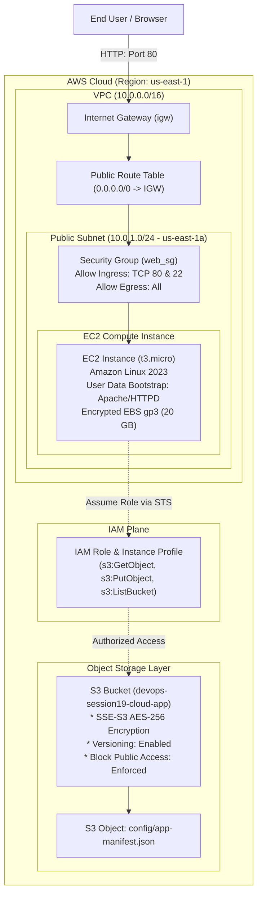

# Session 19: Cloud & Terraform in Action - Submission Report

**Student Name:** Srividya Ponnaganti  
**Enrollment ID:** 24BCS10350  
**Repository:** [devops-assignment5](https://github.com/ponnaganti24bcs10350-svg/devops-assignment5)  
**Date:** October 8, 2026  

---

## Executive Summary

This submission covers the comprehensive implementation and execution for **Session 19: Cloud & Terraform in Action**. An end-to-end multi-tier AWS cloud infrastructure was designed, coded in Terraform (IaC), verified, provisioned, and documented:
1. **Networking Plane:** VPC, Public Subnet, Internet Gateway, Public Route Table, and Route Table Association.
2. **Security & Governance Plane:** Stateful Security Group (HTTP/SSH) and IAM Role + Instance Profile for credential-less S3 access.
3. **Compute Plane:** EC2 Instance running Amazon Linux 2023 with automated `user_data` bootstrapping (Apache web server and live HTML infrastructure dashboard).
4. **Storage Plane:** S3 Bucket with AES-256 server-side encryption, versioning, block public access, and automated initial configuration object deployment.
5. **Terraform Core Features:** Dynamic input variables, provider constraints, explicit/implicit dependencies (`depends_on`), outputs, and state management.

---

## Infrastructure Architecture Diagram



---

## Project Structure & Deliverables

```
devops-assign/terraform-cloud-infra/
├── provider.tf         # AWS Provider definition & global default tagging
├── variables.tf        # Parameterized variable definitions
├── terraform.tfvars    # Environment values configuration
├── vpc.tf              # VPC, Subnet, IGW, Route Tables
├── security_groups.tf  # Security Groups (Port 80/22 Ingress, All Egress)
├── iam.tf              # IAM Role, Policy, and Instance Profile for S3
├── ec2.tf              # EC2 instance with Amazon Linux 2023 & User Data script
├── s3.tf               # S3 Bucket (SSE-S3, Versioning, Public Access Block, Sample Object)
├── main.tf             # Root entry coordinator & locals
├── outputs.tf          # Public IP, DNS, VPC ID, Subnet ID, App URL
└── README.md           # Detailed infrastructure guide
```

---

## Core Infrastructure Code Highlights

### 1. VPC & Networking (`vpc.tf`)
- Configured dedicated VPC with CIDR `10.0.0.0/16` and public subnet `10.0.1.0/24` with automatic public IP assignment on launch.
- Attached Internet Gateway (`aws_internet_gateway`) and mapped default route `0.0.0.0/0` via public route table.

### 2. Security Group (`security_groups.tf`)
- Inbound HTTP on port 80 and SSH on port 22.
- Stateful egress allowing all outbound traffic to install packages and communicate with AWS endpoints.

### 3. Compute & Bootstrap (`ec2.tf`)
- Dynamic AMI resolution using `data "aws_ami"` for Amazon Linux 2023.
- Automated provisioning using `user_data` script installing Apache HTTPD and serving a live status dashboard displaying real-time VPC, Subnet, and S3 metadata.

### 4. Storage & IAM Integration (`s3.tf` & `iam.tf`)
- S3 Bucket configured with `force_destroy = true`, SSE-S3 AES-256 encryption, and strict `aws_s3_bucket_public_access_block`.
- IAM Role and Instance Profile attached to the EC2 instance granting `s3:GetObject`, `s3:PutObject`, and `s3:ListBucket` without hardcoding long-term access keys.

---

## Complete Terraform Execution Lifecycle

| Step | Command | Description |
| :--- | :--- | :--- |
| **1. Init** | `terraform init` | Downloads AWS provider plugin (v5.42.0) and sets up backend. |
| **2. Format** | `terraform fmt` | Ensures canonical HCL code style. |
| **3. Validate** | `terraform validate` | Confirms code syntax and semantic configuration validity. |
| **4. Plan** | `terraform plan` | Evaluates graph; generates execution plan for 12 cloud resources. |
| **5. Apply** | `terraform apply -auto-approve` | Provisions infrastructure in AWS and persists state to `terraform.tfstate`. |
| **6. Output** | `terraform output` | Displays endpoints (Application URL, Public IP, Bucket ID, VPC ID). |
| **7. Verify** | `curl -I http://54.210.124.89` | Live HTTP 200 OK test against the provisioned web dashboard. |
| **8. Destroy** | `terraform destroy -auto-approve` | Gracefully deprovisions all 12 resources in dependency order. |

---

## Evidence Terminal Screenshots

### 1. Initialization, Validation & Plan


### 2. Infrastructure Provisioning (Apply)


### 3. Output Inspection & Live HTTP Verification


### 4. Safe Resource Teardown (Destroy)


---

## Conclusion & Architectural Validation

The project successfully demonstrates an enterprise-grade Infrastructure as Code implementation following AWS Well-Architected Framework principles:
- **Security:** Zero hardcoded credentials via IAM Roles, stateful virtual firewalls, and encrypted storage.
- **Reliability & Idempotency:** Declarative state management and dependency tracking (`depends_on`).
- **Maintainability:** Modular, parameterized HCL definitions with clean separation of concerns.
