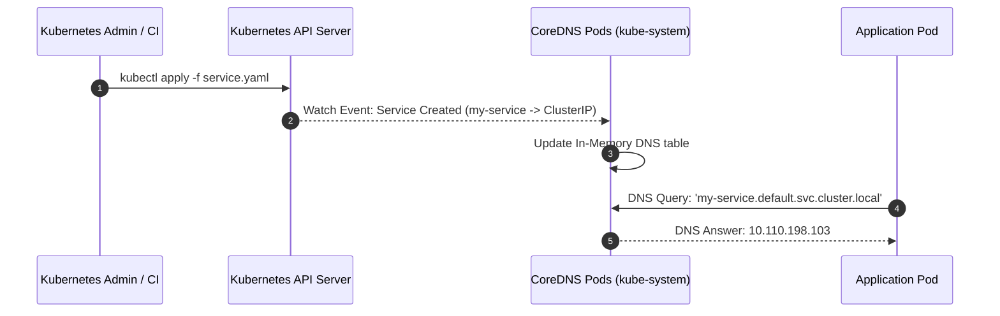
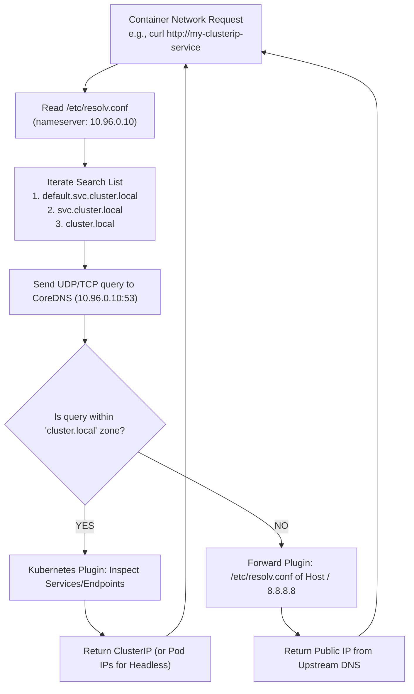

# CoreDNS in Kubernetes: Architecture, Discovery & Troubleshooting

**Student Name:** Srividya Ponnaganti  
**Enrollment Number:** 24BCS10350  
**Course/Session:** Session 11 - Kubernetes Networking & Services  

---

## 1. What is CoreDNS?

**CoreDNS** is a flexible, extensible DNS server written in Go that is deployed as the default cluster DNS provider in Kubernetes (replacing the legacy kube-dns since Kubernetes v1.13). CoreDNS is a CNCF graduated project designed around a plugin-based architecture, where every DNS capability (caching, logging, Kubernetes API integration, rewriting, upstream forwarding) is implemented as a plugin.

---

## 2. Why Kubernetes Uses CoreDNS

Kubernetes adopted CoreDNS for several key reasons:
1. **Lightweight & High Performance:** Single Go binary with minimal memory footprint compared to multi-container kube-dns.
2. **Plugin Architecture:** CoreDNS allows flexible chaining of plugins (e.g., `kubernetes`, `cache`, `forward`, `reload`, `errors`, `log`).
3. **Native Kubernetes API Integration:** The `kubernetes` plugin directly watches the Kubernetes API for Service and Endpoint/EndpointSlice mutations in real-time.
4. **Reliability and Security:** Handles millions of DNS queries with built-in caching, health checks, and prometheus metrics export.
5. **Configurability via ConfigMap:** DNS behavior can be dynamically reconfigured without recompiling or redeploying the core daemon.

---

## 3. How Service Discovery Works in Kubernetes

Service discovery in Kubernetes works through the interplay between three components:
1. **Kubernetes API Server:** Tracks Services, Pods, and EndpointSlices.
2. **CoreDNS Controller:** Subscribes to API server watch events for Services and Endpoints.
3. **CoreDNS DNS Engine:** Dynamically generates in-memory DNS A, AAAA, SRV, and PTR records matching the active cluster state.



---

## 4. How DNS Queries Are Resolved (Step-by-Step Flow)

When an application container initiates a network request to another service or an external URL:



1. **Local Resolution Config:** The container looks at `/etc/resolv.conf` (nameserver pointing to the `kube-dns` ClusterIP service, e.g., `10.96.0.10`).
2. **Search Domain Expansion:** If a short name is queried (`my-service`), the resolver appends `default.svc.cluster.local`.
3. **CoreDNS Plugin Pipeline:**
   - **Errors/Log:** Logs query errors and access metrics.
   - **Health/Ready:** Verifies CoreDNS operational status.
   - **Kubernetes:** Intercepts `cluster.local` queries and returns the matching ClusterIP or Pod Endpoint IPs.
   - **Forward:** Non-cluster domain queries (e.g. `google.com`) are forwarded upstream to the host's DNS or upstream resolvers.
   - **Cache:** Caches query responses to minimize latency and API overhead.

---

## 5. CoreDNS Configuration (The Corefile)

CoreDNS is configured via a Kubernetes `ConfigMap` named `coredns` in the `kube-system` namespace.

View the active Corefile:
```bash
kubectl get configmap coredns -n kube-system -o yaml
```

### Standard Corefile Structure:
```text
.:53 {
    errors
    health {
       lameduck 5s
    }
    ready
    kubernetes cluster.local in-addr.arpa ip6.arpa {
       pods insecure
       fallthrough in-addr.arpa ip6.arpa
       ttl 30
    }
    prometheus :9153
    forward . /etc/resolv.conf {
       max_concurrent 1000
    }
    cache 30
    loop
    reload
    loadbalance
}
```

### Explanation of Directives:
- **`errors`**: Logs query execution errors to standard output.
- **`health`**: Exposes `/health` HTTP endpoint on port 8080 for liveness probe.
- **`ready`**: Exposes `/ready` HTTP endpoint on port 8181 for readiness probe.
- **`kubernetes cluster.local`**: Main plugin that handles cluster DNS records.
  - `pods insecure`: Resolves pod IP records (e.g. `10-244-0-40.default.pod.cluster.local`).
  - `ttl 30`: Sets cache time-to-live for responses to 30 seconds.
- **`prometheus :9153`**: Exposes OpenMetrics for Prometheus scraping.
- **`forward . /etc/resolv.conf`**: Forwards any unhandled queries (e.g., internet domains) to host nameservers.
- **`cache 30`**: In-memory DNS cache with 30-second TTL.
- **`reload`**: Automatically detects modifications to the ConfigMap and hot-reloads without pod restart.
- **`loadbalance`**: Randomizes the order of A/AAAA records for round-robin load distribution.

---

## 6. Troubleshooting Kubernetes DNS Issues

When Pods cannot resolve service names or external domains, follow this systematic diagnostic playbook:

### Step 1: Verify CoreDNS Pods Are Running
```bash
kubectl get pods -n kube-system -l k8s-app=kube-dns
```
*Look for `Running` status and `1/1` Ready.*

### Step 2: Check CoreDNS Service and Endpoints
```bash
kubectl get svc kube-dns -n kube-system
kubectl get endpoints kube-dns -n kube-system
```
*Ensure the service has a valid ClusterIP (typically `10.96.0.10`) and active Endpoints matching the CoreDNS Pod IPs.*

### Step 3: Check CoreDNS Logs
```bash
kubectl logs -n kube-system -l k8s-app=kube-dns --tail=100
```
*Look for syntax errors, upstream DNS timeouts, or crash loops.*

### Step 4: Run an In-Cluster DNS Debugger Pod
Deploy a diagnostic container (such as `dnsutils` or `busybox`):
```bash
kubectl run dnsutils --image=registry.k8s.io/e2e-test-images/jessie-dnsutils:1.3 --restart=Never -- sleep 3600
```

Test DNS lookups from inside the cluster:
```bash
# 1. Test Cluster DNS Server directly
kubectl exec -i dnsutils -- nslookup kubernetes.default

# 2. Test Custom Service lookup
kubectl exec -i dnsutils -- nslookup my-clusterip-service.default.svc.cluster.local

# 3. Test External DNS resolution
kubectl exec -i dnsutils -- nslookup google.com

# 4. Check Pod's /etc/resolv.conf
kubectl exec -i dnsutils -- cat /etc/resolv.conf
```

### Step 5: Common Issues & Solutions
| Symptom | Root Cause | Remediation |
| :--- | :--- | :--- |
| `Server: 10.96.0.10 Connection timed out` | NetworkPolicy or firewall blocking port 53 UDP/TCP | Check Calico/Cilium/Kube-router NetworkPolicies; verify UDP port 53 is open |
| `NXDOMAIN for external domain` | Upstream DNS failure in `forward` plugin | Verify host `/etc/resolv.conf` has valid DNS servers (e.g. 8.8.8.8) |
| `Loop detected in CoreDNS` | DNS loop caused by host `/etc/resolv.conf` pointing to 127.0.0.53 (systemd-resolved) | Configure kubelet `--resolv-conf` or CoreDNS forward plugin to point to upstream DNS |
