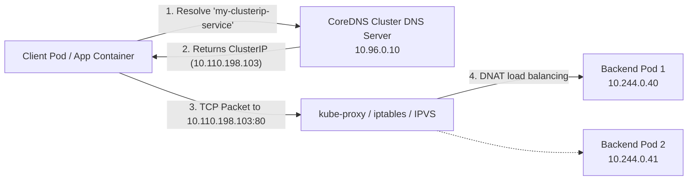

# Fully Qualified Domain Names (FQDN) in Kubernetes

**Student Name:** Srividya Ponnaganti  
**Enrollment Number:** 24BCS10350  
**Course/Session:** Session 11 - Kubernetes Networking & Services  

---

## 1. What is an FQDN?

A **Fully Qualified Domain Name (FQDN)** is an unambiguous, complete domain name that specifies the exact location of a host or resource in the tree hierarchy of the Domain Name System (DNS). 

An FQDN includes:
1. **Hostname / Service Name**
2. **Subdomain / Hierarchy** (e.g., Namespace, resource type)
3. **Top-Level Domain (TLD) / Cluster Domain** (e.g., `cluster.local`)
4. An optional trailing dot `.` representing the DNS root.

Example standard FQDN: `web.example.com.`  
Example Kubernetes FQDN: `my-service.default.svc.cluster.local.`

---

## 2. Kubernetes Service DNS

Kubernetes runs an internal cluster DNS service (CoreDNS) by default. Whenever a Kubernetes `Service` is created, CoreDNS dynamically allocates a DNS A/AAAA record pointing to the Service's virtual ClusterIP (or individual Pod IPs in the case of Headless Services).

This eliminates the need for hardcoded IP addresses, enabling dynamic service discovery across the cluster.

---

## 3. Kubernetes DNS Naming Convention

Kubernetes follows a structured, hierarchical DNS naming scheme for Services and Pods:

### Service DNS Structure
```
<service-name>.<namespace>.svc.<cluster-domain>
```

- `<service-name>`: The metadata name given to the Service (e.g., `my-clusterip-service`).
- `<namespace>`: The Kubernetes namespace where the service resides (e.g., `default`, `kube-system`, `production`).
- `svc`: Specifies that the DNS resource is a Service.
- `<cluster-domain>`: The cluster base domain configured in kubelet/CoreDNS (default: `cluster.local`).

### Headless Service & Individual Pod DNS Structure
For StatefulSets backed by a Headless Service (`clusterIP: None`):
```
<pod-name>.<service-name>.<namespace>.svc.<cluster-domain>
```
Example: `app-headless-0.my-headless-service.default.svc.cluster.local`

---

## 4. Namespace-Based DNS Resolution

Kubernetes configures each Pod's `/etc/resolv.conf` with a DNS search path. This search list allows resolution of short names based on proximity:

Example `/etc/resolv.conf` inside a Pod in the `default` namespace:
```text
nameserver 10.96.0.10
search default.svc.cluster.local svc.cluster.local cluster.local
options ndots:5
```

### How Resolution Works:
1. **Same Namespace:**
   - A Pod in namespace `default` can access `my-clusterip-service` simply by querying `my-clusterip-service` or `my-clusterip-service.default`.
   - CoreDNS expands this using search domains to `my-clusterip-service.default.svc.cluster.local`.
2. **Cross-Namespace Communication:**
   - A Pod in namespace `frontend` wanting to reach a database in namespace `backend` queries:
     `db-service.backend` or `db-service.backend.svc.cluster.local`.

---

## 5. Pod-to-Service Communication Flow



1. **DNS Lookup:** The client pod queries CoreDNS for `my-clusterip-service.default.svc.cluster.local`.
2. **ClusterIP Return:** CoreDNS replies with the virtual ClusterIP (e.g. `10.110.198.103`).
3. **Packet Transmission:** Client sends HTTP/TCP traffic to the ClusterIP.
4. **Kernel Load Balancing:** `kube-proxy` rules (via iptables or IPVS) intercept the ClusterIP traffic and DNAT (Destination Network Address Translation) route it to one of the healthy endpoint Pod IPs.

---

## 6. Examples of Kubernetes FQDNs

| Resource Type | Scope / Usage | Example FQDN | Resolved Value |
| :--- | :--- | :--- | :--- |
| **Standard ClusterIP Service** | Default namespace | `my-clusterip-service.default.svc.cluster.local` | Virtual ClusterIP (e.g. `10.110.198.103`) |
| **Cross-Namespace Service** | Production namespace | `payment-api.production.svc.cluster.local` | Virtual ClusterIP |
| **Kubernetes API Server** | Default namespace | `kubernetes.default.svc.cluster.local` | API Server ClusterIP (`10.96.0.1`) |
| **Headless Service** | Default namespace | `my-headless-service.default.svc.cluster.local` | Pod IPs directly (`10.244.0.40`, `10.244.0.41`) |
| **StatefulSet Specific Pod** | Default namespace | `app-headless-0.my-headless-service.default.svc.cluster.local` | Dedicated Pod IP (`10.244.0.40`) |
| **ExternalName Service** | External CNAME | `my-external-service.default.svc.cluster.local` | CNAME alias to `api.github.com` |
