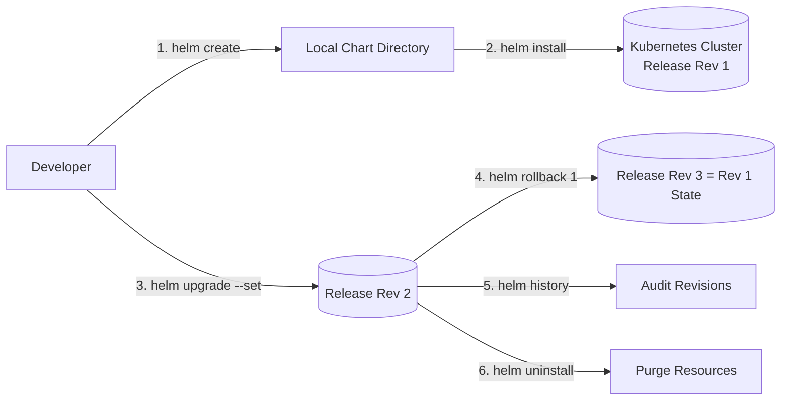

# Helm Commands Reference Guide & Hands-on Practice

**Student Name:** Srividya Ponnaganti  
**Enrollment Number:** 24BCS10350  
**Course/Session:** Session 15 - Helm Package Manager for Kubernetes  

---

## 1. What is Helm?

**Helm** is the official package manager for Kubernetes. It allows DevOps engineers to define, install, version, and upgrade complex Kubernetes applications using reusable packages called **Helm Charts**.

Key Helm concepts:
- **Chart:** A collection of YAML templates and default configuration files (`values.yaml`).
- **Release:** A specific running instance of a chart deployed into a Kubernetes cluster.
- **Repository:** An HTTP/OCI registry where packaged charts are stored and shared.
- **Values:** Configuration inputs used to inject custom dynamic data into chart templates.

---

## 2. Essential Helm Commands Reference

### 1. `helm create <name>`
- **Purpose:** Scaffolds a new standard Helm chart directory structure.
- **Generated Layout:** Includes `Chart.yaml`, `values.yaml`, `templates/` (deployment, service, hpa, ingress, serviceaccount), and `_helpers.tpl`.
- **Command:**
  ```bash
  helm create my-app-chart
  ```

---

### 2. `helm repo` (`add`, `list`, `update`, `remove`)
- **Purpose:** Manages external Helm chart repositories.
- **Commands:**
  ```bash
  # Add a remote repository
  helm repo add bitnami https://charts.bitnami.com/bitnami

  # List configured repositories
  helm repo list

  # Update local repository cache
  helm repo update
  ```

---

### 3. `helm search` (`repo`, `hub`)
- **Purpose:** Searches for available Helm charts locally or on Artifact Hub.
- **Commands:**
  ```bash
  # Search cached local repositories
  helm search repo bitnami/nginx

  # Search global Artifact Hub
  helm search hub prometheus
  ```

---

### 4. `helm install <release-name> <chart>`
- **Purpose:** Deploys a new chart package into the cluster creating a new Release (Revision 1).
- **Key Flags:** `--set key=value`, `-f custom-values.yaml`, `--namespace <ns>`, `--create-namespace`.
- **Command:**
  ```bash
  helm install demo-release ./my-app-chart --set replicaCount=2
  ```

---

### 5. `helm list` (`helm ls`)
- **Purpose:** Lists all active Helm releases deployed in the current namespace (or across all namespaces with `-A`).
- **Command:**
  ```bash
  helm list
  helm list -A
  ```

---

### 6. `helm status <release-name>`
- **Purpose:** Displays the runtime status, namespace, revision number, last deployed time, and rendered `NOTES.txt` for a release.
- **Command:**
  ```bash
  helm status demo-release
  ```

---

### 7. `helm get` (`values`, `manifest`, `all`, `notes`)
- **Purpose:** Extracts specific metadata and artifacts from an active cluster release.
- **Commands:**
  ```bash
  # Retrieve user-supplied values
  helm get values demo-release

  # Retrieve complete rendered Kubernetes YAML manifest
  helm get manifest demo-release

  # Retrieve all release data (hooks, values, manifest, notes)
  helm get all demo-release
  ```

---

### 8. `helm upgrade <release-name> <chart>`
- **Purpose:** Upgrades an existing release to a new chart version or applies modified configuration values, creating a new Revision.
- **Command:**
  ```bash
  helm upgrade demo-release ./my-app-chart --set replicaCount=4
  ```

---

### 9. `helm history <release-name>`
- **Purpose:** Displays the complete revision history, deployment timestamps, status, chart version, and description for a release.
- **Command:**
  ```bash
  helm history demo-release
  ```

---

### 10. `helm rollback <release-name> <revision>`
- **Purpose:** Rolls back a release to any previous stable revision in its history.
- **Command:**
  ```bash
  helm rollback demo-release 1
  ```

---

### 11. `helm uninstall <release-name>`
- **Purpose:** Removes a release from Kubernetes and purges all associated workloads and resources.
- **Command:**
  ```bash
  helm uninstall demo-release
  ```

---

## 3. Helm Workflow Summary


