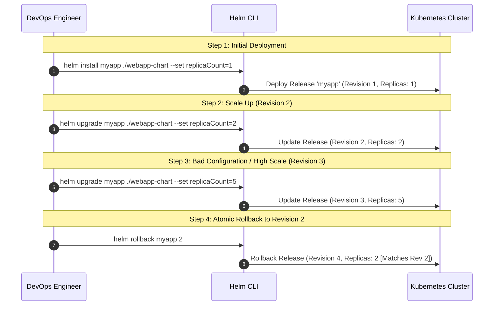

# Helm Release Lifecycle: Installation, Upgrades & Rollback Workflow

**Student Name:** Srividya Ponnaganti  
**Enrollment Number:** 24BCS10350  
**Course/Session:** Session 15 - Helm  

---

## 1. Rollback Lifecycle Overview

Helm tracks every change made to a release as an immutable **Revision** stored inside Kubernetes Secrets in the release namespace. This revision history enables instant, atomic rollbacks to any earlier version without downtime or manual configuration drift.



---

## 2. Step-by-Step Hands-on Workflow

### Phase 1: Initial Installation (Revision 1)
Deploy the chart with initial replica count of `1`:
```bash
helm install myapp ./webapp-chart --set replicaCount=1
```
**Verification:**
```bash
$ helm list
NAME    NAMESPACE   REVISION    UPDATED                                 STATUS      CHART           APP VERSION
myapp   default     1           Wed Oct  8 00:15:00 2026                deployed    webapp-0.1.0    1.16.0

$ kubectl get pods -l app.kubernetes.io/name=webapp
NAME                     READY   STATUS    RESTARTS   AGE
myapp-7db5c5b4df-6d7x9   1/1     Running   0          15s
```

---

### Phase 2: First Upgrade (Revision 2)
Scale the deployment to `2` replicas and update service:
```bash
helm upgrade myapp ./webapp-chart --set replicaCount=2
```
**Verification:**
```bash
$ helm history myapp
REVISION    UPDATED                     STATUS          CHART           APP VERSION     DESCRIPTION
1           Wed Oct  8 00:15:00 2026    superseded      webapp-0.1.0    1.16.0          Install complete
2           Wed Oct  8 00:15:45 2026    deployed        webapp-0.1.0    1.16.0          Upgrade complete

$ kubectl get pods -l app.kubernetes.io/name=webapp
NAME                     READY   STATUS    RESTARTS   AGE
myapp-7db5c5b4df-6d7x9   1/1     Running   0          60s
myapp-7db5c5b4df-k82ms   1/1     Running   0          10s
```

---

### Phase 3: Second Upgrade (Revision 3)
Scale the deployment to `5` replicas:
```bash
helm upgrade myapp ./webapp-chart --set replicaCount=5
```
**Verification:**
```bash
$ helm history myapp
REVISION    UPDATED                     STATUS          CHART           APP VERSION     DESCRIPTION
1           Wed Oct  8 00:15:00 2026    superseded      webapp-0.1.0    1.16.0          Install complete
2           Wed Oct  8 00:15:45 2026    superseded      webapp-0.1.0    1.16.0          Upgrade complete
3           Wed Oct  8 00:16:30 2026    deployed        webapp-0.1.0    1.16.0          Upgrade complete

$ kubectl get pods -l app.kubernetes.io/name=webapp
# Shows 5 running pods
```

---

### Phase 4: Atomic Rollback to Revision 2
Execute rollback to Revision 2:
```bash
helm rollback myapp 2
```
**Verification:**
```bash
$ helm history myapp
REVISION    UPDATED                     STATUS          CHART           APP VERSION     DESCRIPTION
1           Wed Oct  8 00:15:00 2026    superseded      webapp-0.1.0    1.16.0          Install complete
2           Wed Oct  8 00:15:45 2026    superseded      webapp-0.1.0    1.16.0          Upgrade complete
3           Wed Oct  8 00:16:30 2026    superseded      webapp-0.1.0    1.16.0          Upgrade complete
4           Wed Oct  8 00:17:15 2026    deployed        webapp-0.1.0    1.16.0          Rollback to 2

$ kubectl get pods -l app.kubernetes.io/name=webapp
NAME                     READY   STATUS    RESTARTS   AGE
myapp-7db5c5b4df-6d7x9   1/1     Running   0          2m
myapp-7db5c5b4df-k82ms   1/1     Running   0          1m
```
*Notice that Kubernetes terminates the extra 3 pods and immediately restores the exact 2-replica configuration of Revision 2.*

---

## 3. Summary of Revision Progression

| Revision | Action | Target Configuration | Observed Pod Count | Status in History |
| :--- | :--- | :--- | :--- | :--- |
| **1** | `helm install` | `replicaCount: 1` | 1 Pod | `superseded` |
| **2** | `helm upgrade` | `replicaCount: 2` | 2 Pods | `superseded` |
| **3** | `helm upgrade` | `replicaCount: 5` | 5 Pods | `superseded` |
| **4** | `helm rollback 2`| Restores Rev 2 (`replicaCount: 2`) | 2 Pods | `deployed` |
