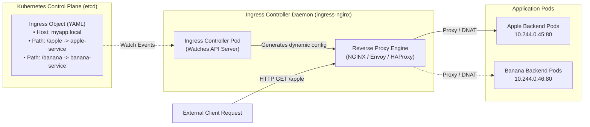

# Kubernetes Ingress vs Ingress Controller

**Student Name:** Srividya Ponnaganti  
**Enrollment Number:** 24BCS10350  
**Course/Session:** Session 12 - Kubernetes Ingress, ConfigMaps & Secrets  

---

## 1. What is an Ingress?

An **Ingress** is a standard Kubernetes API resource (`apiVersion: networking.k8s.io/v1`, `kind: Ingress`) that defines a declarative set of routing rules for incoming HTTP and HTTPS traffic from outside the cluster to internal services.

An Ingress object allows you to define:
- **Host-based routing** (e.g., `api.example.com` vs `web.example.com`)
- **Path-based routing** (e.g., `/orders` to `orders-service`, `/users` to `users-service`)
- **SSL/TLS Termination** (decrypting HTTPS requests at cluster edge)
- **URL Rewriting & Header Modifications**

> **Crucial Concept:** Creating an `Ingress` resource alone does **NOTHING** by default. It is purely a data specification (a set of routing rules stored in etcd).

---

## 2. What is an Ingress Controller?

An **Ingress Controller** is the active control loop / reverse proxy daemon (typically running as a `Deployment` or `DaemonSet` in the cluster) that fulfills and executes the rules defined by Ingress resources.

The Ingress Controller:
1. Constantly watches the Kubernetes API for the creation, modification, or deletion of `Ingress`, `Service`, and `EndpointSlice` resources.
2. Dynamically updates its internal reverse proxy routing configuration (e.g. `nginx.conf`, Envoy dynamic routes, HAProxy config).
3. Hot-reloads or synchronizes its routing engine.
4. Directly intercepts external network traffic and proxies requests to backend Pod endpoints.

---

## 3. Detailed Comparison: Ingress vs Ingress Controller

| Comparison Aspect | Ingress | Ingress Controller |
| :--- | :--- | :--- |
| **What it is** | Declarative Kubernetes API object (configuration/blueprint). | Active Software Daemon / Application (executor/worker). |
| **Where it lives** | Stored as JSON/YAML metadata in `etcd`. | Runs as Pods (e.g., in `ingress-nginx` namespace). |
| **Functionality** | Defines *what* traffic should go *where* (rules, paths, hosts). | Performs *how* traffic is routed, load-balanced, and encrypted. |
| **Built-in Status** | Native API resource supported by Kubernetes API server. | **Not** built into Kubernetes core; must be deployed/enabled (e.g., Minikube ingress addon). |
| **Analogy** | A **flight itinerary / ticket** with destinations and rules. | The **airplane & pilot** physically transporting the passengers. |
| **Lifecycle** | Created via `kubectl apply -f ingress.yaml`. | Installed via Helm, Operator, or `minikube addons enable ingress`. |

---

## 4. Why Both Are Required

- **Separation of Concerns:** Developers define how their applications should be reached using standardized `Ingress` YAML manifests without worrying about the underlying proxy implementation.
- **Infrastructure Abstraction:** Platform engineers choose, scale, and maintain the Ingress Controller (e.g. NGINX on-prem, AWS ALB on AWS, GKE Ingress on Google Cloud) without forcing developers to change their application routing manifests.

---

## 5. Popular Ingress Controller Examples

| Ingress Controller | Technology Base | Primary Environment & Features |
| :--- | :--- | :--- |
| **NGINX Ingress Controller** (Community / F5) | NGINX | Most widely used; supports extensive annotations, canary routing, rate limiting, and basic auth. |
| **AWS Load Balancer Controller** | AWS ALB / NLB | Native AWS cloud integration; provisions Application Load Balancers per Ingress. |
| **Traefik Ingress Controller** | Traefik (Go) | Cloud-native, automatic Let's Encrypt TLS certificates, dynamic middleware support. |
| **HAProxy Ingress** | HAProxy | Ultra-high performance, low memory footprint, high-throughput HTTP/TCP proxying. |
| **Kong Ingress Controller** | Kong / OpenResty | API Gateway capabilities (authentication, OAuth2, plugins, rate limiting, monitoring). |
| **Emissary-ingress / Ambassador** | Envoy | Microservices API gateway, gRPC routing, OAuth, distributed tracing. |
