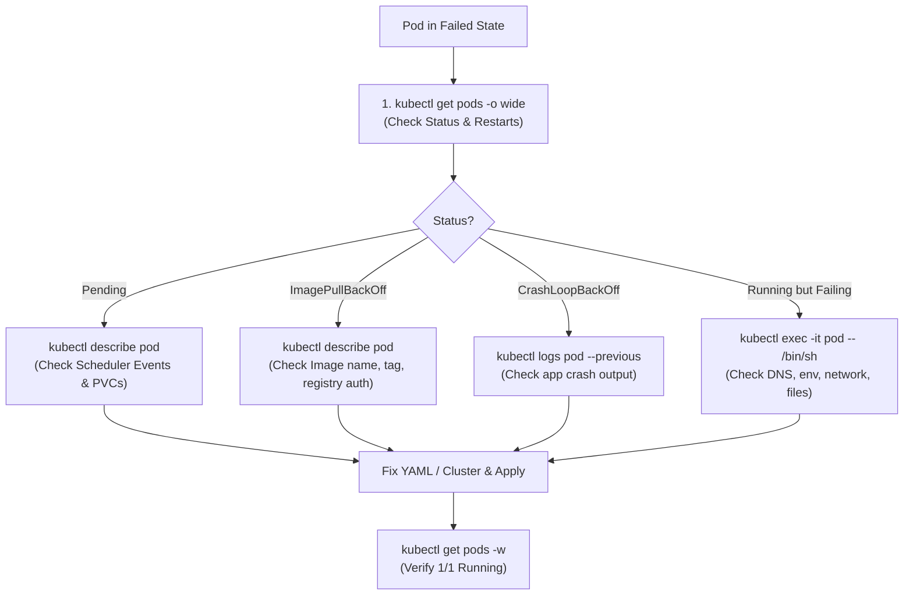

# Kubernetes Troubleshooting Commands Reference Guide

**Student Name:** Srividya Ponnaganti  
**Enrollment Number:** 24BCS10350  
**Course/Session:** Session 14 - Kubernetes Troubleshooting  

---

## 1. Overview
Effective troubleshooting in Kubernetes requires a structured diagnostic approach using core `kubectl` CLI commands to inspect cluster state, investigate control plane events, inspect application logs, and interact with running containers.

---

## 2. Essential Troubleshooting Commands

### 1. `kubectl get`
- **Purpose:** Lists one or more resources (Pods, Services, Deployments, Nodes) in tabular form.
- **Troubleshooting Utility:** Quickly check the high-level status (`Running`, `CrashLoopBackOff`, `Pending`, `Error`), restart counts, and readiness (`1/1`, `0/1`).
- **Examples:**
  ```bash
  kubectl get pods
  kubectl get pods -n kube-system
  kubectl get all -l app=my-app
  ```

---

### 2. `kubectl get -o wide`
- **Purpose:** Extends standard tabular output to include critical diagnostic columns: **Pod IP**, **Node name**, **Nominated Node**, and **Readiness Gates**.
- **Troubleshooting Utility:** Instantly identify which Node a failing pod is scheduled on, verify IP assignment from CNI plugin, and verify endpoint IPs.
- **Example:**
  ```bash
  kubectl get pods -o wide
  kubectl get nodes -o wide
  ```

---

### 3. `kubectl describe`
- **Purpose:** Provides a detailed, multi-section report of a specific resource's configuration, status, probes, volume mounts, and real-time **Events**.
- **Troubleshooting Utility:** The **#1 primary command** to investigate why a Pod is `Pending`, `ImagePullBackOff`, or `CrashLoopBackOff`. Shows scheduler decisions, probe failures, and image pull errors.
- **Examples:**
  ```bash
  kubectl describe pod <pod-name>
  kubectl describe node <node-name>
  kubectl describe svc <service-name>
  ```

---

### 4. `kubectl logs`
- **Purpose:** Prints the standard output (stdout) and standard error (stderr) streams from containers in a Pod.
- **Troubleshooting Utility:** Identify application-level fatal errors, uncaught exceptions, missing configuration files, or database connection failures.
- **Key Flags:**
  - `-p` / `--previous`: View logs of the **previous instance** of a crashed container (essential for `CrashLoopBackOff`).
  - `-f` / `--follow`: Stream live container logs in real time.
  - `-c <container>`: Specify container name in multi-container pods.
  - `--tail=100`: Print the last 100 lines.
- **Examples:**
  ```bash
  kubectl logs <pod-name>
  kubectl logs <pod-name> --previous
  kubectl logs -l app=my-app --all-containers=true
  ```

---

### 5. `kubectl exec`
- **Purpose:** Executes a command or opens an interactive terminal shell inside a running container.
- **Troubleshooting Utility:** Test in-cluster network connectivity (`curl`, `nslookup`, `ping`), verify mounted file contents (`cat /etc/config/...`), and inspect runtime environment variables (`env`).
- **Examples:**
  ```bash
  kubectl exec -it <pod-name> -- /bin/sh
  kubectl exec <pod-name> -- env
  kubectl exec <pod-name> -- nslookup kubernetes.default
  ```

---

### 6. `kubectl events` / `kubectl get events`
- **Purpose:** Streams cluster-level events chronologically across all objects in a namespace.
- **Troubleshooting Utility:** Identify cluster-wide anomalies, node pressure events (DiskPressure, MemoryPressure), failed scheduling, container killed by OOMKiller, or failing probes.
- **Examples:**
  ```bash
  kubectl events --types=Warning
  kubectl get events --sort-by=.metadata.creationTimestamp
  kubectl get events -n kube-system
  ```

---

### 7. `kubectl explain`
- **Purpose:** Displays interactive documentation and schema definition for any Kubernetes resource or field directly in the terminal.
- **Troubleshooting Utility:** Quick validation of YAML syntax, required fields, and supported field types when writing or debugging manifests without leaving the terminal.
- **Examples:**
  ```bash
  kubectl explain pod.spec.containers.livenessProbe
  kubectl explain deployment.spec.strategy
  kubectl explain hpa.spec.metrics
  ```

---

### 8. `kubectl top`
- **Purpose:** Displays real-time CPU (milli-cores) and Memory (MiB) utilization metrics for Nodes and Pods via the Metrics Server.
- **Troubleshooting Utility:** Diagnose CPU throttling, excessive memory usage leading to OOMKills, and verify HPA metrics consumption.
- **Examples:**
  ```bash
  kubectl top nodes
  kubectl top pods
  kubectl top pods -A --sort-by=cpu
  kubectl top pods -A --sort-by=memory
  ```

---

## 3. Kubernetes Diagnostic Workflow Cheat Sheet


