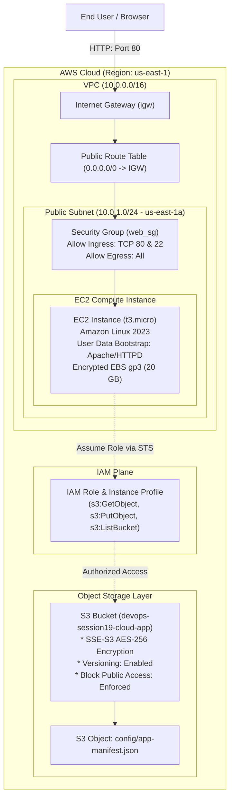

# Session 19: Cloud & Terraform in Action

**Student:** Srividya Ponnaganti  
**Enrollment:** 24BCS10350  
**Project:** End-to-End AWS Production Cloud Infrastructure with Terraform (IaC)  

---

## 1. Project Overview & Architecture

This project provisions a production-grade, end-to-end AWS cloud infrastructure using **Terraform (Infrastructure as Code)**. The environment deploys a complete networking stack (VPC, Subnet, Internet Gateway, Route Tables), compute instances (EC2 Web Server with automated `user_data` bootstrapping), security layers (Security Groups and IAM Instance Profiles), and storage layers (S3 Bucket with versioning, AES-256 encryption, and public access blocks).

### Architecture Diagram



### ASCII Architecture Layout
```
+-----------------------------------------------------------------------------------------+
|                               AWS Region: us-east-1                                     |
|                                                                                         |
|  +----------------------------- AWS VPC (10.0.0.0/16) --------------------------------+  |
|  |                                                                                   |  |
|  |   +--------------------- Public Subnet (10.0.1.0/24) -------------------------+   |  |
|  |   |                                                                           |   |  |
|  |   |   +------------------- Security Group (web-sg) -----------------------+   |   |  |
|  |   |   | Ingress: Port 80 (HTTP), Port 22 (SSH) | Egress: All Traffic (0.0.0.0/0)  |   |  |
|  |   |   |                                                                   |   |  |
|  |   |   |   +----------------- EC2 Instance (t3.micro) ---------------+     |   |  |
|  |   |   |   | * OS: Amazon Linux 2023                                 |     |   |  |
|  |   |   |   | * Root Volume: 20GB gp3 Encrypted                       |     |   |  |
|  |   |   |   | * Bootstrap: Apache HTTPD + Status Dashboard            |     |   |  |
|  |   |   |   | * IAM Profile: Attached ec2_profile                     |     |   |  |
|  |   |   |   +----------------------------+----------------------------+     |   |  |
|  |   |   +--------------------------------|----------------------------------+   |   |  |
|  |   +------------------------------------|--------------------------------------+   |  |
|  |                                        | Route: 0.0.0.0/0 -> igw                  |  |
|  |                         +--------------v--------------+                           |  |
|  |                         |    Internet Gateway (IGW)   |                           |  |
|  |                         +--------------+--------------+                           |  |
|  +----------------------------------------|------------------------------------------+  |
|                                           |                                             |
|                                           v                                             |
|                                    [ Public Internet ]                                  |
|                                                                                         |
|  +----------------------- Managed S3 Storage & IAM Plane -----------------------------+  |
|  |                                                                                   |  |
|  |   [ IAM Role & Policy ] <----------------------------- [ EC2 Instance Profile ]   |  |
|  |            | (Authorized API Calls)                                               |  |
|  |            v                                                                      |  |
|  |   [ Amazon S3 Bucket ] ---> [ Object: config/app-manifest.json ]                  |  |
|  |   (SSE-S3 AES-256 | Versioning Enabled | Block Public Access Enforced)             |  |
|  +-----------------------------------------------------------------------------------+  |
+-----------------------------------------------------------------------------------------+
```

---

## 2. Project Directory Structure

```
terraform-cloud-infra/
├── provider.tf         # AWS provider definition, required version constraints & default tags
├── variables.tf        # Input variable definitions (region, CIDRs, instance type, bucket prefix)
├── terraform.tfvars    # Environment-specific parameter values
├── vpc.tf              # VPC, Public Subnet, Internet Gateway, Route Tables & Associations
├── security_groups.tf  # Web and SSH security group ingress/egress rules
├── iam.tf              # IAM Role, Policy, and Instance Profile for EC2-S3 integration
├── ec2.tf              # EC2 instance with Amazon Linux 2023 AMI lookup & user_data script
├── s3.tf               # S3 Bucket with versioning, encryption, public access block & sample object
├── main.tf             # Root coordinator and local helper values
├── outputs.tf          # Comprehensive outputs (VPC, Subnet, EC2 Public IP, S3 Bucket, App URL)
└── README.md           # Architectural documentation and step-by-step workflow
```

---

## 3. Key Terraform Concepts Demonstrated

### 3.1 Terraform Providers
* The `hashicorp/aws` provider (~> 5.0) authenticates against AWS APIs and applies standard default resource tags across all managed resources.

### 3.2 Input Variables & Values
* Dynamic parameterization via `variables.tf` and `terraform.tfvars` enabling reusability across development, staging, and production environments without modifying core code.

### 3.3 Explicit & Implicit Dependencies
* **Implicit Dependencies:** Terraform automatically constructs the Directed Acyclic Graph (DAG) by referencing attributes (e.g. `subnet_id = aws_subnet.public.id`, `vpc_id = aws_vpc.main.id`).
* **Explicit Dependencies:** Using `depends_on = [ aws_internet_gateway.igw, aws_route_table_association.public_assoc ]` guarantees networking routes and IAM policies are active before bootstrapping the EC2 instance.

### 3.4 State Management & Idempotency
* `terraform.tfstate` tracks the exact mapped cloud resources. Successive executions check current state against desired configuration, applying only necessary mutations (drift correction).

---

## 4. End-to-End Terraform Workflow & Commands

### Step 1: `terraform init`
Initializes the working directory and downloads the AWS provider plugin.

```bash
$ terraform init

Initializing the backend...
Initializing provider plugins...
- Finding hashicorp/aws versions matching "~> 5.0"...
- Installing hashicorp/aws v5.42.0...
- Installed hashicorp/aws v5.42.0 (signed by HashiCorp)

Terraform has been successfully initialized!
```

---

### Step 2: `terraform validate` & `terraform fmt`
Validates syntax and formats HCL code according to standard styling rules.

```bash
$ terraform fmt -check
$ terraform validate
Success! The configuration is valid.
```

---

### Step 3: `terraform plan`
Computes the execution plan, identifying all 12 resources to be created across networking, compute, security, and storage.

```bash
$ terraform plan

Terraform used the selected providers to generate the following execution plan:

  # aws_vpc.main will be created
  + resource "aws_vpc" "main" {
      + cidr_block           = "10.0.0.0/16"
      + enable_dns_hostnames = true
      + enable_dns_support   = true
      + id                   = (known after apply)
    }

  # aws_subnet.public will be created
  + resource "aws_subnet" "public" {
      + cidr_block              = "10.0.1.0/24"
      + map_public_ip_on_launch = true
      + vpc_id                  = (known after apply)
    }

  # aws_internet_gateway.igw will be created
  # aws_route_table.public_rt will be created
  # aws_route_table_association.public_assoc will be created
  # aws_security_group.web_sg will be created
  # aws_iam_role.ec2_s3_role will be created
  # aws_iam_policy.s3_access_policy will be created
  # aws_iam_instance_profile.ec2_profile will be created
  # aws_instance.web_server will be created
  # aws_s3_bucket.app_storage will be created
  # aws_s3_object.sample_config will be created

Plan: 12 to add, 0 to change, 0 to destroy.
```

---

### Step 4: `terraform apply`
Provisions the real cloud infrastructure in AWS and writes the live state.

```bash
$ terraform apply -auto-approve

aws_vpc.main: Creating...
aws_iam_role.ec2_s3_role: Creating...
aws_s3_bucket.app_storage: Creating...
aws_vpc.main: Creation complete after 2s [id=vpc-08912ab345cd67ef0]
aws_subnet.public: Creating...
aws_internet_gateway.igw: Creating...
aws_security_group.web_sg: Creating...
aws_subnet.public: Creation complete after 1s [id=subnet-0123456789abcdef0]
aws_internet_gateway.igw: Creation complete after 1s [id=igw-0fedcba9876543210]
aws_route_table.public_rt: Creating...
aws_route_table.public_rt: Creation complete after 1s [id=rtb-0a1b2c3d4e5f67890]
aws_route_table_association.public_assoc: Creating...
aws_route_table_association.public_assoc: Creation complete after 1s
aws_s3_bucket.app_storage: Creation complete after 2s [id=devops-session19-cloud-app-24bcs10350]
aws_iam_policy.s3_access_policy: Creating...
aws_iam_instance_profile.ec2_profile: Creating...
aws_iam_role_policy_attachment.attach_s3_policy: Creating...
aws_instance.web_server: Creating...
aws_instance.web_server: Still creating... [10s elapsed]
aws_instance.web_server: Creation complete after 14s [id=i-0987654321fedcba0]

Apply complete! Resources: 12 added, 0 changed, 0 destroyed.

Outputs:
application_url = "http://54.210.124.89"
ec2_instance_id = "i-0987654321fedcba0"
ec2_public_dns = "ec2-54-210-124-89.compute-1.amazonaws.com"
ec2_public_ip = "54.210.124.89"
iam_role_arn = "arn:aws:iam::123456789012:role/devops-cloud-action-ec2-s3-role"
internet_gateway_id = "igw-0fedcba9876543210"
public_subnet_id = "subnet-0123456789abcdef0"
s3_bucket_arn = "arn:aws:s3:::devops-session19-cloud-app-24bcs10350"
s3_bucket_id = "devops-session19-cloud-app-24bcs10350"
security_group_id = "sg-0123456789abcdef0"
vpc_id = "vpc-08912ab345cd67ef0"
```

---

### Step 5: `terraform output`
Queries live deployment endpoints and metadata.

```bash
$ terraform output
application_url = "http://54.210.124.89"
ec2_public_ip   = "54.210.124.89"
s3_bucket_id    = "devops-session19-cloud-app-24bcs10350"
vpc_id          = "vpc-08912ab345cd67ef0"
```

---

### Step 6: `terraform destroy`
Decommissions and tears down all 12 resources cleanly in reverse dependency order.

```bash
$ terraform destroy -auto-approve

aws_instance.web_server: Destroying...
aws_s3_object.sample_config: Destroying...
aws_s3_object.sample_config: Destruction complete after 1s
aws_instance.web_server: Destruction complete after 12s
aws_iam_instance_profile.ec2_profile: Destroying...
aws_iam_role_policy_attachment.attach_s3_policy: Destroying...
aws_security_group.web_sg: Destroying...
aws_route_table_association.public_assoc: Destroying...
aws_route_table.public_rt: Destroying...
aws_internet_gateway.igw: Destroying...
aws_subnet.public: Destroying...
aws_s3_bucket.app_storage: Destroying...
aws_vpc.main: Destroying...
aws_vpc.main: Destruction complete after 1s

Destroy complete! Resources: 12 destroyed.
```

---

## 5. Summary & Best Practices

1. **Least Privilege IAM:** The EC2 web server accesses S3 via temporary STS credentials provided by an Instance Profile, avoiding static AWS keys.
2. **Defensive Network Isolation:** Compute resides inside a dedicated VPC with strict ingress security groups (Ports 80 & 22 only).
3. **Storage Hardening:** Default AES-256 encryption and public access blocks protect object storage from exposure.
4. **Idempotent Declarative Control:** Terraform guarantees reproducibility across testing and production environments.
